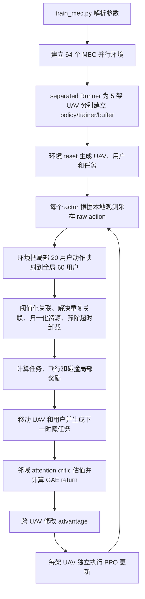

# 5-UAV 项目代码解读与论文一致性审计

## 1. 结论先行

这个项目的核心不是标准 MAPPO，而是在标准 on-policy/MAPPO 框架上加入了以下机制：

1. 每架 UAV 拥有独立 actor、critic、优化器和经验缓冲区。
2. actor 只读取本 UAV 的局部观测，执行阶段不读取全局状态。
3. critic 读取由邻居局部观测拼成的固定长度状态，并使用 masked multi-head self-attention 聚合。
4. actor 输出连续的飞行、关联评分、带宽比例和计算资源比例，再由环境投影成可执行的混合动作。
5. 每架 UAV 获得局部奖励；训练时再对各 UAV 的优势进行额外聚合。

最后一项是论文与代码最需要核对的地方。最终 5-UAV 训练 `run30901` 实际使用的不是论文所写的纯 flooding/consensus 全局平均优势，而是：

```text
用于 PPO 的优势 = 本地优势 + 所有 UAV 本地优势的真实全局均值 + 拓扑相关随机噪声
```

因此，现有结果可以称为带邻域 critic 和跨 UAV 优势融合的独立策略 PPO，但目前代码不足以直接证明训练过程是完全去中心化的 DC-PPO 实现。

## 2. 最终 5-UAV 实验基线

历史结果目录中的 `run30901/args.json` 是最后模型对应的训练配置，时间为 2025-09-13。2025-09-30 的 `run309083` 至 `run309092` 使用 `lr=1e-14` 并加载 `run30901/models`，主要是模型回放和出图，不是重新训练。

关键配置如下：

| 项目 | 最终训练值 |
|---|---:|
| UAV 数 | 5 |
| MD/GU 数 | 60 |
| 场景 | 600 m x 600 m，双热点 |
| 每回合长度 | 400 slots |
| 并行环境 | 64 |
| 总环境步数 | 100,000,000 |
| actor/critic 是否共享 | 否，每架 UAV 一套 |
| actor | 局部观测 MLP |
| critic | 邻域状态 attention critic |
| actor 学习率 | 1e-4 |
| critic 学习率 | 5e-4 |
| PPO clip | 0.15 |
| PPO epochs | 4 |
| 折扣因子 | 0.99 |
| GAE lambda | 0.95 |
| actor entropy 系数 | 0 |
| UAV 邻域距离 | 260 m |
| UAV 服务半径 | 120 m |
| 每架 UAV 最多观察用户数 | 20 |
| 带宽 | 30 MHz |
| UAV 最大 CPU | 20 GHz |
| UAV 最大速度 | 30 m/s |
| 用户平均速度 | 0.5 m/s |

## 3. 程序执行链



训练入口是 `onpolicy/scripts/train/train_mec.py`。当 `share_policy=False` 时，程序选择 `runner/separated/mec_runner.py`。`separated/base_runner.py` 为每架 UAV 分别创建 `R_MAPPOPolicy`、`R_MAPPO` trainer 和 `SeparatedReplayBuffer`，所以不是参数共享式 MAPPO。

## 4. MEC 环境

### 4.1 场景初始化

最终 5-UAV、60 用户、固定热点场景中，UAV 初始位置为：

```text
UAV 0: (400, 400)
UAV 1: (70, 70)
UAV 2: (140, 70)
UAV 3: (210, 70)
UAV 4: (280, 70)
高度统一为 120 m
```

用户分为两个区域：

- 10 个用户均匀初始化在 `[0,175] x [0,175]`。
- 50 个用户均匀初始化在 `[200,600] x [200,600]`。

用户使用一阶 Gauss-Markov 速度/方向模型移动，相关系数为 0.7。用户越界时采用镜像反射并修改移动方向。每个 slot 长 0.5 s。

每个用户每个时隙重新产生任务：

```text
H_n(t) = [D_n(t), C_n(t), Gamma_n(t)]
D: 0.2-0.4 Mbit
C: 675-800 Mcycles
deadline: 0.499-0.5 s
```

### 4.2 信道模型

环境根据 UAV 和用户的三维距离计算仰角，再使用概率 LoS/NLoS 空地信道模型：

```text
P_LoS = 1 / (1 + a * exp(-b * (theta-a)))
PL = P_LoS * PL_LoS + (1-P_LoS) * PL_NLoS
h = 10^(-PL/10)
R_ni = B_ni * log2(1 + P_tx*h_ni/(N0*B_ni))
```

代码参数为 `a=9.61`、`b=0.16`、载频 2 GHz、用户发射功率 1 W、`N0=1e-16 W/Hz`。

### 4.3 局部观测

最终配置开启时间步，不使用 agent one-hot。每架 UAV 的局部观测维数为 184：

```text
1     当前 time_step
2     本 UAV 的二维位置
1     当前覆盖范围内用户数量
20x9  最多 20 个用户的信息
-----------------------------
184
```

每个用户占 9 维：

```text
[x, y, direction, channel_gain, D, C, deadline, user_id, cannot_finish_locally]
```

用户槽位不是简单按距离排列。代码先放置“本地计算无法在 deadline 内完成”的用户，再在两组内部按距离排序。这会使 actor 优先看见更需要卸载的任务，是训练效果明显提升的一项工程设计。

需要注意：论文写有用户 velocity，但当前观测只包含移动方向，不包含实时速度标量；速度只用于环境状态转移。

### 4.4 邻域 critic 状态

`state_is_k_hops=True`、`all_uav_k_hops=True`、`max_UAVs_obs_concat=5` 时，每个 critic 输入为 5 个 184 维槽位，共 920 维：

```text
[self_obs, UAV-0/1/2/3/4 的对应槽位]
```

自身槽位总是有效；与当前 UAV 二维距离不超过 260 m 的 UAV 槽位填入其观测，其他槽位补零，同时生成 attention mask。

虽然变量名叫 `k_hops`，最终代码并没有在图上执行 k 次消息传播。它实际表示“位于给定几何距离阈值内的 UAV 集合”。实验中改变 k 的效果主要通过改变 `neighbor_distance` 或场景尺度实现。

### 4.5 原始动作空间

最终动作由四部分构成，总维数为 62：

```text
2   flight: [direction_score, speed_score]
20  association scores
20  bandwidth proportions
20  computation proportions
```

- 飞行和关联评分由固定标准差 0.4 的 Gaussian 采样。
- Gaussian 均值经过 sigmoid，但样本本身仍可能落在 `[0,1]` 外。
- 带宽和计算资源由 Dirichlet 分布采样，天然满足各自总和为 1。
- `not_process_action=True` 虽然名字容易误解，最终路径恰恰会调用动作后处理，并将 raw action 留在 buffer 中用于 PPO 概率比计算。

### 4.6 动作后处理

环境按以下顺序把 raw action 变为可执行动作：

1. 将所有 raw action clip 到 `[0,1]`。
2. 根据每架 UAV 当前局部用户列表，将 20 个局部槽位映射回 60 个全局用户 ID。
3. 关联分数低于 0.5 的候选置零。
4. 对同一用户，只保留分数最高的候选 UAV；代码实际用 3D 距离解决相同最大值或多选冲突。
5. 没有候选 UAV 的用户执行本地计算。
6. 每架 UAV 的带宽和计算比例分别归一化。
7. 根据传输时延和 UAV 执行时延验证 deadline；不能按时完成的卸载被取消。
8. 取消后再次归一化剩余资源。

这种设计对应论文中的确定性投影 `tilde(a)=P(a)`。PPO 保存并计算的是 raw action 的 log probability，环境执行的是投影后的 hybrid action。

### 4.7 时延与能耗

本地计算：

```text
tau_local = C/F_n
E_local = k_local * F_n^2 * C
```

UAV 卸载：

```text
tau_trans = D/R
tau_exe = C/f_alloc
E_trans = P_tx * tau_trans
E_exe = k_server * f_alloc^2 * C
```

飞行能耗采用旋翼 UAV 常用功率模型，包括 blade profile、induced power 和 fuselage drag 三部分，再乘 slot 长度得到能量。

### 4.8 局部奖励

每架 UAV 的即时奖励为：

```text
R_i = R_task_delay_i + R_task_energy_i + R_flight_i + R_collision_i
```

任务及时完成时：

```text
R_delay = gamma_r * (1 + deadline - actual_delay)
```

超时则为 `-delta_r`。能耗项为 `-lambda_r * clip(E,0,10)`；飞行能耗使用同一个 `lambda_r`。若 UAV 间距小于 3 m，每个碰撞邻居产生 `-mu_r`。

最终训练权重为：

```text
gamma_r=26, delta_r=32, lambda_r=1e-6, mu_r=64
```

局部 credit assignment 规则：

- 用户成功卸载时，任务收益归服务它的 UAV。
- 覆盖范围内但最终本地执行时，收益归距离该用户最近的覆盖 UAV。
- 不在任何 UAV 覆盖范围内的用户不进入训练奖励，但会进入部分 `true_all_GUs` 评估指标。

`alpha_r=32` 虽保存在最终配置中，但覆盖奖励代码已经被整段注释，因此该参数对最终训练没有作用。`beta_r`、`epsilon_r` 和 `q1-q5` 也不是最终有效奖励的组成部分。

## 5. DC-PPO 网络与更新

### 5.1 独立 actor

每架 UAV 有独立 actor，输入为 184 维局部观测。网络由带 LayerNorm 的 MLP 构成，hidden size 为 256，最终通过四个分布头输出动作。

最终使用 `algorithm_name=mappo`，所以 `use_recurrent_policy=False`。项目目录名里的 `last-obs` 不表示最终 actor 使用 RNN；最终 5-UAV actor 是前馈 MLP。

### 5.2 邻域 attention critic

每架 UAV 也有独立 critic：

1. 将 920 维输入 reshape 为 `5 x 184`。
2. 每个 UAV 槽位经共享 MLP 编码为 256 维。
3. 使用 4-head self-attention；Q/K/V 从 256 映射到 512，每个 head 128 维。
4. 用邻域 mask 排除补零槽位。
5. 对有效槽位做 masked mean aggregation。
6. 经后续 MLP 输出标量价值。

因此它不是 centralized critic。每个 critic 只能使用 260 m 范围内可收到的 UAV 局部观测摘要。

### 5.3 return 和本地 advantage

每个独立 buffer 保存 400 步轨迹，通过标准 GAE 计算 return。初始本地优势为：

```text
A_i_local = return_i - V_i(neighborhood_state)
```

环境观测、邻域状态和奖励分别使用每架 UAV 自己的 running mean/std 归一化。最终配置使用 `ret_norm=True`，同时关闭 trainer 内的 ValueNorm。

### 5.4 最终训练真正使用的优势融合

`run30901` 开启：

```text
average_local_advantage_timely=True
average_local_advantage=True
whether_local_add_direct_ave_adv=True
```

这会执行：

```text
A_mean = mean_i(A_i_local)
A_i_buffer = A_i_local + A_mean
A_i_buffer += topology_noise_i
```

其中 `topology_noise_i` 根据回合结束时 UAV 连通分量均值与真实全局均值之间的偏差构造，并乘 `0.12 * std(A_local) * GaussianNoise`。

关键事实：

- `A_mean` 由 runner 直接读取全部 5 个 buffer 后求均值，不是 flooding 消息传递。
- 最终使用的是 `A_i_local + A_mean`，不是论文公式中的 `A_mean`。
- `n_iterations=30` 在这个分支中没有被使用。
- 每个时隙保存的 Metropolis 权重在这个最终分支中也没有参与优势更新。
- 连通图仅用于决定附加噪声大小，而且使用的是回合结束位置，不是各时隙拓扑。

代码中确实存在 Metropolis 迭代分支和 `run_consensus_algorithm()`，但最终配置没有走这些分支。Git 历史在 2025-08-08 的提交说明中明确记录“共识有问题”，随后加入了 direct true mean 分支。

### 5.5 PPO 更新

每架 UAV 独立执行 PPO：

```text
ratio = exp(log pi_new(raw_action) - log pi_old(raw_action))
L_actor = -min(ratio*A, clip(ratio,1-eps,1+eps)*A)
L_critic = clipped value loss
```

实现额外对 `log_ratio` 和 importance ratio 做数值裁剪，并裁剪 actor/critic 梯度。最终 `entropy_coef=0`，所以 entropy 不影响训练。

`R_MAPPO` 中用于额外 ratio clipping 的 `action_dim` 被硬编码为 63，但最终动作实际为 62 维。它只影响附加的数值稳定阈值，不改变网络输出维度，但应改成从 action space 自动推导。

## 6. 论文与代码一致性

### 一致的部分

- actor 只依赖本 UAV 局部观测。
- 每架 UAV 使用独立策略和独立 critic。
- critic 使用邻域局部观测和 attention mask。
- 环境实现连续 raw action 到混合可执行动作的确定性投影。
- 用户关联、带宽、计算资源和 UAV 轨迹被联合优化。
- 局部奖励采用服务 UAV/最近覆盖 UAV 的 credit assignment。
- 环境目标只让可见用户影响训练奖励。

### 需要修正或补证的部分

#### P0：优势平均与论文核心公式不一致

论文使用 `bar A_i` 直接更新 actor，并声称通过 flooding 或 consensus 去中心化获得。最终训练代码使用 `A_i_local + global_mean + noise`，且 `global_mean` 由中央 runner 直接计算。

这会同时影响“完全去中心化训练”的表述、理论与实现对应关系，以及实验方法的可复现性。

#### P0：现有 Fig. 8 不是最终训练代码的通信过程记录

Fig. 8 使用独立脚本和合成 advantage 数据生成，用于展示 flooding/consensus 的理论通信误差，不是 `run30901` 训练期间记录的真实优势交换轨迹。

#### P1：k-hop 命名与实现不完全一致

代码用单个几何距离阈值直接选邻居，不执行图上的 k-hop message passing。论文应把它准确解释为由 `d_k` 定义的几何邻域，或者代码应显式构造 k-hop 图邻域。

#### P1：观测中的用户速度描述不一致

论文写入用户 velocity；代码只放入 direction，没有放入实时速度值。

#### P1：Dirichlet mask 是近似实现

不可用用户槽位的 concentration 被设为 0.1，而不是严格从 Dirichlet 支撑集中删除；采样结果也没有在 distribution 内重新 mask/归一化。环境随后忽略无效槽位，因此执行动作可行，但 raw-action log probability 仍受无效维影响。

#### P1：最终训练并非 5 个种子的完整证据链

当前归档的 Fig. 4 曲线数据只有 3 条轨迹，而论文写所有结果平均 5 个随机种子。需要找到另外两条原始曲线或修改论文表述并重跑。

#### P2：若干历史参数已失效

`alpha_r`、`beta_r`、`epsilon_r`、`q1-q5`、`w1/w2/p3` 等参数部分未进入最终有效奖励路径，容易误导后续实验。

#### P2：评估代码可能已经过时

`separated/mec_runner.py::eval()` 仍按旧版 reset/step 返回值和单一 normer 编写，与当前多 normer、额外 Metropolis/attention 返回值不一致。最终出图实际采用极小学习率加载模型继续 rollout，而不是该 eval 路径。

## 7. 现在应如何理解这套算法

从代码事实出发，最准确的描述是：

> 一个分离参数的多智能体 PPO 系统。每架 UAV 使用局部观测 actor 和 masked neighborhood-attention critic；环境通过确定性投影联合执行轨迹、用户关联、带宽和计算资源动作；训练时使用局部回报，并额外融合跨 UAV 的优势信息。

在修正优势聚合实现之前，不建议直接把当前 `run30901` 称为严格实现论文公式的 fully decentralized DC-PPO。已有结果更接近一个用于验证算法思想的研究原型，其中环境与邻域 critic 已较完整，但优势通信层仍保留实验性分支和中央 runner 逻辑。

## 8. 推荐的后续工程顺序

1. 冻结当前结果：保留 `fcb891d`、`run30901` 参数、模型和曲线，作为 legacy result，绝不覆盖。
2. 为论文公式建立单一、明确的 `advantage_aggregation` 实现，至少支持 `global_debug`、`flooding`、`metropolis_consensus` 三种模式。
3. 将最终 actor advantage 改为论文定义的 `bar A_i`，或者明确修改论文，使其与 `A_i_local + bar A_i` 一致并重新推导。
4. 用每个时隙或规定的 hovering-time 拓扑执行真实消息聚合，保存误差、轮数和 payload 日志。
5. 从 action space 自动推导动作维度，严格处理 Dirichlet mask。
6. 修复 eval 路径，建立不更新网络的 deterministic evaluation 脚本。
7. 重新运行至少 5 个种子，并让绘图脚本直接读取带 metadata 的实验目录。

在这些工作完成前，当前目录适合做历史复现和代码审计，不适合直接覆盖式重训。
