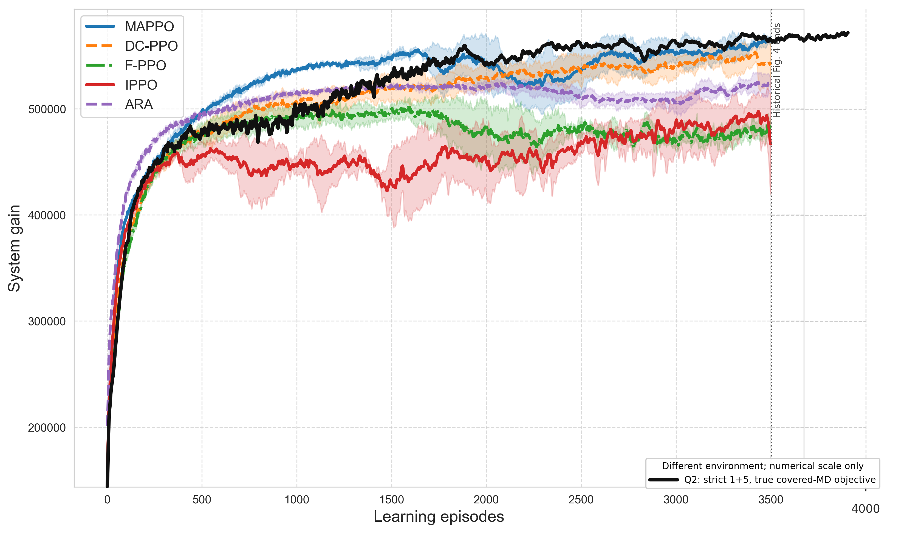

# Q0/Q1/Q2 最终结果与后续对比（2026-07-29 至 2026-07-31）

本文续接 `RECENT_EXPERIMENT_SUMMARY_20260725_20260728.md`。简明状态和待办以 `HANDOFF.md` 为准，按日期的工程记录见 `WORK_NOTES.md`。

## 1. 最终训练曲线

以下均为同一 strict 1+5 环境下的 `system_performance_true_all_GUs`，`last20` 为最后 20 个记录点均值。

| 实验 | 关键配置 | 结束步数 | last20 | 末段接纳率 | 末段平均 active | 结果 |
| --- | --- | ---: | ---: | ---: | ---: | --- |
| E1 | Cartesian Spatial，无 curriculum | 47.13M | 398,118 | 0.7581 | 42.79 | 中途停止 |
| E2 | Cartesian Spatial + curriculum | 99.97M | 469,346 | 0.8911 | 50.85 | curriculum 改善明显 |
| B0 | Cartesian 普通 actor + curriculum | 98.53M | 456,287 | 0.8772 | 49.16 | 普通 actor 基线 |
| B1 | B0 + actor neighbor observation | 97.46M | 451,979 | 0.8745 | 48.73 | 邻居观测无收益 |
| Q0 | Polar 普通 actor + curriculum + completion priority | 99.97M | 527,045 | 0.8259 | 48.17 | 稳定、有竞争力 |
| Q1 | Polar Spatial + curriculum + completion priority | 99.97M | 458,473 | 0.7062 | 41.18 | 94M 后退化 |
| **Q2** | **Cartesian Spatial + curriculum + completion priority** | **99.97M** | **570,817** | **0.9099** | **52.76** | **当前最佳** |

Q1 的最后 50 个点为 469,809，最佳 20 点窗口为 491,458。它的较好轨迹评测来自约 94.2M checkpoint，不应与最终 100M 模型混用。

Q0/Q1/Q2 已消除 E1 时代的资源用户排序归因混杂：completion-priority 排序成为显式开关，飞行编码与资源排序不再隐式绑定。

## 2. 共同十集确定性评测

三个模型使用共同的 10 个环境随机种子。active 只统计 slots 201–400，以减弱初始 UAV 位置造成的冷启动偏差。

| 模型/checkpoint | True60 | Eq60 | 实际覆盖目标 | 接纳率 | 完成率 | 后半段 active | 总航程 |
| --- | ---: | ---: | ---: | ---: | ---: | ---: | ---: |
| Q0 final | 552,312 ± 9,129 | 565,707 ± 8,091 | 362,540 ± 5,623 | 0.8160 | 0.98162 | 49.55 | 1,424 m |
| Q1 94.2M | 516,332 ± 4,113 | 532,890 ± 3,575 | 351,806 ± 3,680 | 0.7680 | 0.97479 | 46.87 | 1,046 m |
| **Q2 90.2M** | **612,606 ± 3,039** | **619,205 ± 2,917** | **372,675 ± 1,048** | **0.9193** | **0.97920** | **56.08** | **4,967 m** |

Q2 final-100M 的 fresh `seed=100000` 评测为 True60 624,690、Eq60 630,370、接纳率 0.93083、后半段 active 56.5、完成率 98.13%。该 episode 没有碰撞和边界事件，最小机间距 35.2 m，最终形成左下 1 架、右上 4 架的部署。

这些是环境评测种子而不是训练种子。当前结果足以选主干，不足以替代论文中的多训练 seed 均值与方差。

## 3. 动作学习审计

### 3.1 飞行

Q2 学到持续受控巡航：final 单集平均命令速度 4.55 m/s、95 分位 9.53 m/s、总航程 4,548 m。它没有复现早期 DC-PPO 的左上角吸收，但也没有学成定点悬停；飞行惩罚权重 `1e-6` 使持续巡航在当前目标下几乎无代价。

### 3.2 关联与资源

Q2 final 单集的 20,021 个候选卸载中最终选择 11,803 个，后处理取消率 41.05%。给所有候选直接等分资源会把 True60 从 624,690 降到 550,337，证明最终卸载筛选有效。

保持相同已选集合、仅将带宽和 CPU 等分时，10 个环境种子的结果为：

| 资源规则 | True60 均值 ± 标准差 |
| --- | ---: |
| learned allocation | 615,090.9 ± 4,925.2 |
| same selected set + equal allocation | 621,893.8 ± 4,825.9 |

等分资源平均提高 6,802.9（1.106%），10/10 seeds 获胜。因此准确结论是：覆盖与最终选择已经足够好，连续资源比例仍有约 1% 次优。根据当前研究决策，不再围绕资源训练方式继续搜索，固定 Q2 主干进入对比实验。

## 4. 与旧论文 Fig.4 的量级关系

旧图和新环境不可公平比较，但叠图可检查数量级。在学习 episode 3500 左右，Q2 平滑 True-all 为 564,703，历史 MAPPO 为 563,720、DC-PPO 为 541,077、ARA 为 522,358；Q2 最后原始点为 572,665，最后 20 点均值 570,817。

旧 Fig.4 使用固定 60 用户、不同统计协议，并包含历史后处理；此图只能作为量级诊断，不能支持跨环境优越性声明。

## 5. 已启动的下一阶段对比

三条训练均保留 Q2 的环境、飞行、curriculum 和 completion-priority 主干，只改变算法或 DC-PPO 通信距离。截至 2026-07-31 22:15：

| 实验目录 | 当前步数 | 最新单点 True-all | 状态 |
| --- | ---: | ---: | --- |
| `q2backbone_dcppo_comm260_seed2_100m_20260731` | 28.544M | 507,555 | 运行中 |
| `q2backbone_dcppo_comm520_seed2_100m_20260731` | 28.186M | 465,279 | 运行中 |
| `q2backbone_ippo_independent_seed2_100m_r64_20260731` | 30.336M | 546,977 | 运行中 |

中途点不用于排名。跑满后必须使用同一组确定性环境种子，报告 True60、Eq60、实际覆盖目标、接纳率、完成率、slots 201–400 平均 active、轨迹和边界/碰撞事件。随后为 Q2 和有竞争力的基线补多个训练 seed。

## 6. 证据索引

- `paper_artifacts/diagnostics/true_all_competitive_q012_20260730_220752/`
- `paper_artifacts/diagnostics/q0_q1_q2_coverage_time_20260730/`
- `paper_artifacts/diagnostics/q0_q1_q2_ranked_trajectories_20260730.png`
- `paper_artifacts/diagnostics/fig4_q2_true_all_overlay_20260731/`
- `paper_artifacts/diagnostics/final_policy_audit_20260731/raw_action_audit.json`
- `paper_artifacts/diagnostics/final_policy_audit_20260731/q2_multiseed_resource_check.json`
