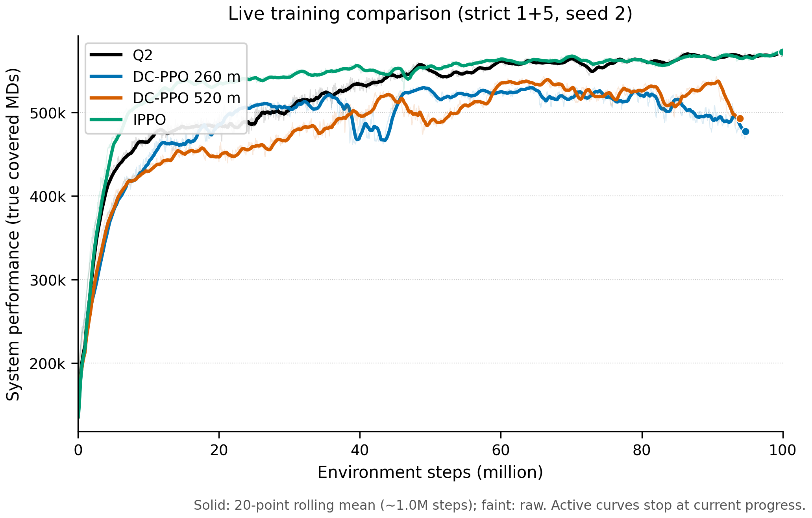
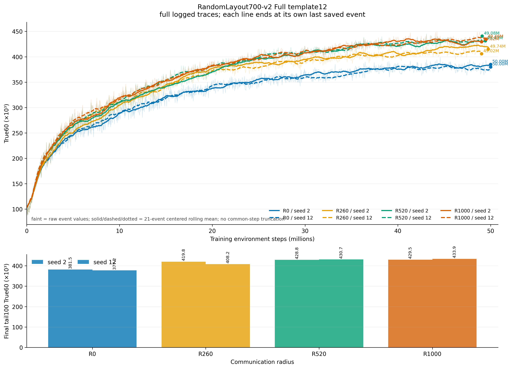
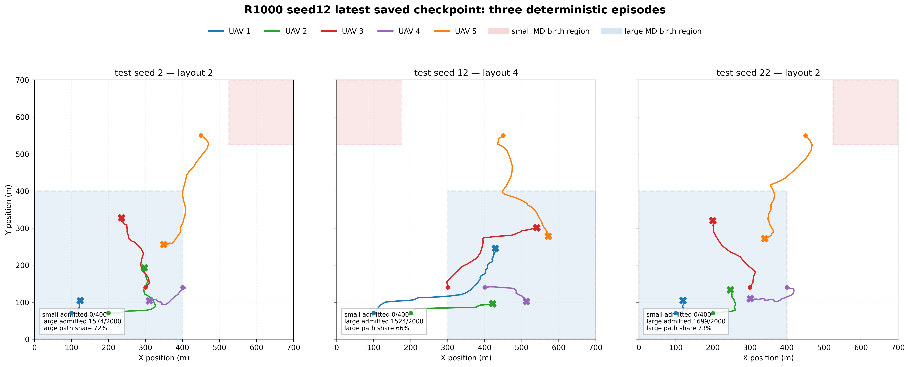
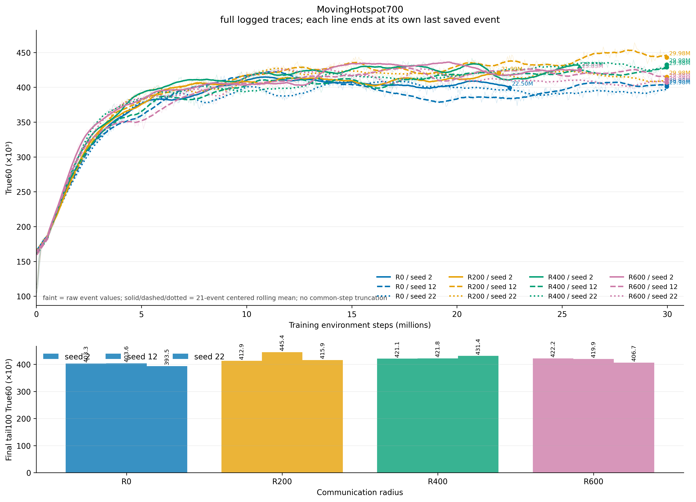
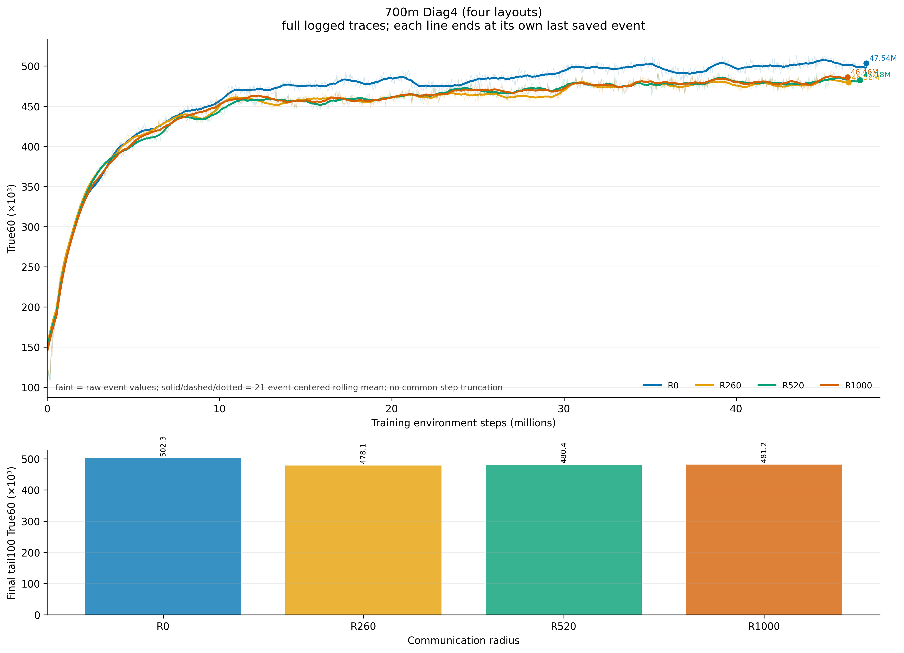
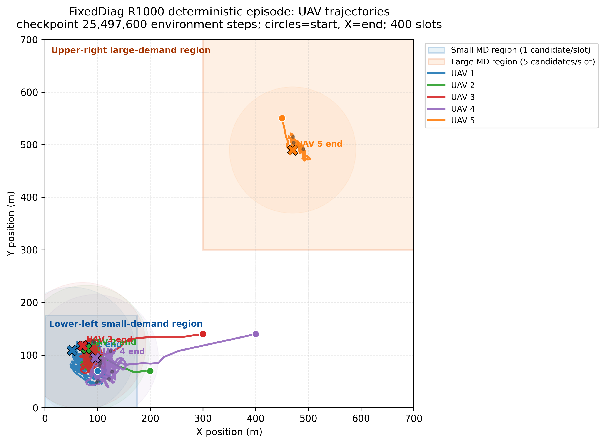

# 近一周实验总结与交接（2026-08-01 至 2026-08-08）

> 本文是 8 月 1 日至 8 日实验的唯一周级交接入口。它依据三条 Codex 任务线的对话记录、仓库内保存的 TensorBoard 导出、CSV/JSON 汇总、训练参数和评估图重新整理。8 月 6–8 日远程设备已经不可连接；新增章节只使用本地会话导出和已保存快照，不代表再次读取远端。
>
> 阅读顺序建议：先看第 1 节的判断，再看第 3 节矩阵，最后按第 5 节的图和第 7 节的证据入口回溯原始结果。
>
> 主指标是 agent0/system_performance_true_all_GUs，下文简称 True60。除非特别说明，曲线比较使用实验组内部的共同 TensorBoard step；tail25/tail100 是记录点窗口均值，不是独立训练 seed 的置信区间。

## 0. 文档定位与证据状态

这次重排解决三个问题：

1. 把“机制诊断”“正式环境训练”“训练后策略评估”分开，避免不同实验合同被直接排名。
2. 把每个实验的目的、唯一变化、数据、结论、处理和完成状态放到同一行。
3. 把暂态趋势、中途停止和历史早期 checkpoint 明确标出来，不把它们写成最终结论。

状态标签：

| 标签 | 含义 |
|---|---|
| 已完成/可比较 | 预算和协议足够，结果可以用于当前判断 |
| 诊断完成 | 达到诊断目的，但不一定达到原计划的 50M/100M |
| 停止/未完成 | 因负面证据、资源或故障停止；只能作方向性证据 |
| 预检/非 PPO | training-free 几何或启发式预检，不是训练结果 |
| 未纳入 | 已启动或属于 8 月 6 日之后，截止日没有可用最终结果 |

## 1. 执行摘要：本周到底推进了什么

### 1.1 当前主线判断

1. **Q2 是稳定的任务主干和基线。**
   它使用 Cartesian Spatial Flight Actor、completion-priority、动态 MD 和 reset curriculum，已经能学出有效的 1+4 部署与持续服务行为。10 个固定评估 episode 的 True60 均值为 **617,738 ± 4,096**，这里的 ± 是 10 个 episode 的样本标准差，不是训练 seed 误差。

2. **通信收益主要出现在 Actor 能执行的邻居消息中，而不是“Critic 看得更远”本身。**
   R1000 geometry message 相对 zero message 约提升 12%–13%；只扩大 Critic 半径、加入团队优势、增加共识轮次或提高 MD 速度，都没有形成可靠的半径阶梯。

3. **RandomLayout700-v2 Full template12、无 UAV curriculum，是目前最值得继续验证的正式实验族。**
   两个训练 seed 在约 49.024M 的共同窗口得到：

   R0 < R260 < R520 < R1000

   tail100 True60 为 379.8k < 413.8k < 429.6k < 431.4k。这是目前最接近目标的曲线，但 R520 到 R1000 只有约 0.43%，且 R1000 在部分布局中忽略小区域，所以仍是“候选结果”，不是论文级结论。

4. **当前真正的风险是区域负载捷径，而不是训练曲线不够高。**
   环境每时隙在小区域生成 1 个候选、在大区域生成 5 个候选。R1000 策略可能主要服务大区域，从而获得较高总 True60，却没有证明完成两个区域的均衡部署。

5. **后续工作应从“继续扫半径/优势/速度”切换到“固定评估 + 分区诊断 + 消息反事实”。**
   只有当同一 checkpoint 在 overall、small/large 分区和反事实消息测试上都通过，再追加训练 seed。

### 1.2 实验推进关系

~~~mermaid
flowchart LR
    Q2["Q2 稳定主干"] --> D["优势 / Critic / 共识诊断"]
    D --> A["Actor 消息与门控诊断"]
    A --> E["RandomLayout700-v2 正式环境"]
    E --> V["固定起点评估与分区域审计"]
    V -->|通过| S["补充独立训练 seed"]
    V -->|不通过| T["先修正任务定义或环境"]
    D --> X["停止无证据的优势、beta、K、速度网格"]
    A --> X
~~~

## 2. 统一协议与算法命名合同

### 2.1 共同环境协议

| 项目 | 当前共同设置 |
|---|---|
| UAV/用户 | 5 架 UAV；严格 1+5 动态 MD 候选结构；最多 60 个活跃槽位 |
| episode | 400 slots；每 slot 0.5 s；整段 200 s |
| UAV 运动 | Cartesian Spatial Flight；v_max=30 m/s；每 slot 最大位移 15 m |
| MD | 动态出生/服务过程；通常每个 episode reset 时采样热点，episode 内保持静态 |
| 例外环境 | MovingHotspot700 只移动隐藏的出生区域，不移动或删除已经激活的 MD |
| 训练 | 通常 64 rollout workers；训练 seed 与评估 seed 分开 |
| 课程 | 当前 v2 随机起点概率前 10M 为 0.5，10–25M 线性降至 0；旧 100M 运行使用过更长的随机阶段，不能混写 |

### 2.2 Q2、Local A_i 和 receiver-gated 的区别

运行脚本的底层 algorithm_name 不能单独决定论文中的算法名称；真正的合同由 advantage、critic radius、Actor observation 和消息聚合开关共同决定。

| 配置 | Actor 输入 | Critic/优势 | 通信半径的含义 | 本周角色 |
|---|---|---|---|---|
| Q2 原始主干 | 仅自身 UAV/本地任务输入；actor_neighbor_obs=false | 纯局部 A_i；全局 critic 语义 | 不是 Actor 通信消融 | 稳定基线 |
| Local A_i R260/R1000 | 仍主要是自身输入 | advantage_mode=local、ego-query critic、共享 return normalization；Critic 可见范围为 260/1000m | 只测试 Critic/局部合同，不自动给 Actor 邻居消息 | 机制诊断与策略轨迹对照 |
| Receiver-gated R0/R260/R520/R1000 | 自身输入加 task/geometry 邻居消息；接收 UAV 对每个 sender 独立 gate | 保持纯 A_i 和相同任务目标 | 半径同时决定可接收的 Actor 消息 | 当前正式通信候选 |

因此，Q2 可以称为当前 MAPPO backend 上的纯局部优势基线；Local A_i 是带局部 Critic/局部优势合同的 DC-PPO-style 配置。不能仅凭脚本中的 backend 名称把所有运行都归为同一种算法。

### 2.3 统一比较规则

- 20M 只用于健康检查；50M 才用于正式固定 checkpoint 判断。100M 计划但中途停止的运行必须标注为未完成。
- 训练曲线的 tail25/tail100 只表示该曲线末端的窗口平均；两个训练 seed 才是训练 seed 层面的初步重复。
- 10 个 episode 是策略评估集，不是 10 个训练重复。
- 不跨环境、优势模式、消息字段、速度合同直接按绝对 True60 排名。
- 正式通信结论至少需要共同训练步数、多训练 seed、固定起点评估、small/large 分区指标和消息反事实。

## 3. 实验矩阵

### 3.0 Q2、IPPO 与旧 DC-PPO radius overlay

8 月 1 日保存的基线 overlay 是一张历史进度快照，作用是确认 Q2/IPPO 主干量级和旧 DC-PPO 运行位置，不作为本周 RandomLayout700 正式结论。

| 运行 | 快照 step | tail20 True60 | 状态 |
|---|---:|---:|---|
| Q2 | 99.968M | 570.817k | 已完成 |
| IPPO | 99.968M | 572.405k | 已完成 |
| 旧 DC-PPO R260 | 94.6944M | 477.171k | 截止快照仍在运行，未保存完整 100M 结果 |
| 旧 DC-PPO R520 | 93.9264M | 492.952k | 截止快照仍在运行，未保存完整 100M 结果 |

共同约 93.9264M 的 snapshot smooth20 为 Q2 567.259k、IPPO 564.572k、DC-PPO R260 484.956k、DC-PPO R520 492.952k。这个结果说明旧 radius overlay 没有提供一个足以替代 Q2 的稳定主干，但由于两路 DC-PPO 不是完整预算，不能把它写成严格的最终算法排名。后续 Local A_i 和 RandomLayout700 使用了不同的实验合同，应与这张历史图分开。

证据：paper_artifacts/diagnostics/q2_dcppo_ippo_live_20260801_1715/ 和 paper_artifacts/diagnostics/fig4_q2_dcppo260_dcppo520_ippo_overlay_20260801_1315/。

### 3.1 优势、Critic、共识和权重诊断

证据主入口：paper_artifacts/diagnostics/dcppo_radius_review_20260803/README.md 和其中的 experiment_summary.csv。

| 实验族 | 目的 | 数据结果 | 结论/处理 | 状态 |
|---|---|---|---|---|
| Unified residual R0/R260/R1000 | 检查残差是否随通信半径变小而带来收益 | 共同 54.656M：R260−R0 = −3.10%；R1000−R260 = −5.07% | 稳定反序；停止 | 诊断完成 |
| Mixed-consensus R0/R260/R1000 | 检查 A_i + 0.5 consensus | 共同 53.018M：−5.71%、−2.68%；更晚 67.251M 仍为 R0 > R260 > R1000 | overall/fixed 都不支持目标顺序；停止 | 诊断完成 |
| Local A_i R260/R1000 | 只扩大 Critic 可见范围 | 共同 53.376M：R1000−R260 约 +0.004% | Critic 看得更远几乎没有可测策略收益；停止扩展 | 诊断完成 |
| Pure consensus R260/R1000 | 检查纯团队优势 | 共同 38.733M：R1000 比 R260 低约 16.34% | 信用分配失败；停止 | 停止/未完成 |
| Ego-query vs mean-pool Critic | 检查 attention readout 是否是主因 | 共同 38.579M：mean-pool 低约 0.22% | 不是当前主矛盾；停止大网格 | 诊断完成 |
| R520 K=1/5/50 | 检查共识轮次是否越多越好 | 34.074M 早期 K1→K5 +1.21%、K5→K50 +0.87%；62.438M 时 K50 比 K1 低 0.66% | 不支持 K 单调收益；K1/K50 也未跑满原计划 100M | 停止/未完成 |
| Externality beta=.025/.05/.10 | 检查外部性优势权重 | 约 8.32M：.025 > .05 > .10 | beta 越大越差；停止 | 早期诊断 |
| Mean-pooled task Critic | 试图用池化任务摘要恢复半径收益 | 共同 29.005M：R260−R0 −0.77%；R1000−R260 +1.44% | 没有完整排序；停止盲目扩展 | 停止/未完成 |

**这一支线的总判断：**通信半径不会因为 Critic 看得更远、优势中加入团队项、残差更精确或共识轮次更多，就自然变成更高 True60。纯团队优势还会把其他 UAV 的坏动作传给当前 Actor，产生明显信用分配问题。

### 3.2 Actor 消息与 receiver-gated 诊断

| 实验族 | 目的 | 数据结果 | 结论/处理 | 状态 |
|---|---|---|---|---|
| Mean-pool task message A0/A1/A2 | 同时扩大 Actor 消息和 Critic 半径 | 共同 29.005M：−0.77%、+1.44% | 只有局部趋势；不作为最终消息合同 | 停止/未完成 |
| Zero message A0/B1/A3 | 隔离 Critic-only 作用 | 共同 29.670M：−0.32%、−11.76% | Critic-only 不成立 | 诊断完成 |
| R1000 zero/geometry/task | 隔离消息字段 | geometry−zero +13.99%；task−geometry +0.64% | 邻居相对几何是主要有效信息，完整 task 摘要没有稳定增益 | 诊断完成 |
| 低速 task message vs zero refresh | 检查任务摘要消息相对 Critic-only 的增益 | 共同 42.624M：R0/R260/R1000 的 tail100 约 551.2k/553.6k/551.0k，无半径阶梯 | 消息存在不等于半径单调；停止该组合扩展 | 诊断完成 |
| 高速 MD v=10 | 检查更强移动耦合是否放大通信价值 | 共同 29.773M：+0.40%、−5.39% | 提高 MD 速度没有制造半径收益；停止高速网格 | 诊断完成 |
| 600m receiver-gated G0/G260/G1000 | 防止远端消息被 mean pooling 稀释 | 21.9904M 时相邻增益 +0.225%、+1.040%；到约 36.1728M 的后续快照变成 R260 < R0 < R1000 | 早期完整排序是暂态；原始 G 三路只到约 22–27M，不能当 50M 结论 | 停止/未完成 |

Receiver-gated 只改变 Spatial Flight head 的消息聚合；它没有改变奖励、关联、资源动作、Critic 目标、优势定义或环境公式。它是有机制解释的候选，但正式结论要看下一节的 700m 两 seed 结果以及固定评估。

### 3.3 正式环境、课程和预检矩阵

| 实验族 | 环境与唯一变化 | 数据结果 | 结论/处理 | 状态 |
|---|---|---|---|---|
| 600m/700m 对称起点 preflight | training-free 几何/启发式预检，不训练 PPO | 600m：R260−R0 +6.036%，R1000−R260 +0.035%；700m：+7.579%、+0.158%，且 R1000−R260 只有 57.05% episode 为正 | 700m 未通过预注册的 +0.5% 且 70% 正 episode 门槛；旧非对称起点收益不能直接采信 | 预检/非 PPO |
| 600m Diag4 preflight | 训练前检查四布局信息价值 | R260 相对 R0 约 +5.514%；R1000 相对 R260 约 +0.207% | 说明局部通信可能有价值，但不足以支撑三档 PPO 排序 | 预检/非 PPO |
| RandomLayout700-v2 Full template12，无 UAV curriculum | 700m、12 layouts、固定 staggered 起点；receiver-gated task message；R0/R260/R520/R1000；seed 2/12 | 共同约 49.024M 的 tail100：379.8k/413.8k/429.6k/431.4k；相邻增益约 +8.9%/+3.8%/+0.43% | 目前唯一形成完整训练曲线阶梯的正式组；R520→R1000 太小，且 R1000 有 small-region shortcut，暂定候选 | 已完成/可比较 |
| RandomLayout700-v2 Full template12 + UAV curriculum | 同上，但加入 UAV 起点课程；单 seed 2；计划 50M | 49.9968M tail100：464.0k/472.3k/463.7k/456.1k；R260 最高、R1000 最低 | 课程改变训练分布，但没有保留半径单调收益；不能和无 curriculum 直接合并排名 | 已完成/可比较 |
| MovingHotspot700 | 700m；隐藏出生区域在 episode 内移动；R0/R200/R400/R600；seed 2/12/22 | 共同 21.9904M：394.9k/424.3k/418.2k/417.4k；seed 2 因远端文件系统故障中断 | 有通信优于 R0，但半径不单调；保留为环境诊断，不作为排序证据 | 停止/未完成 |
| 700m Diag4，无 curriculum | 4 个布局；固定起点；R0/R260/R520/R1000 | 约 46.464M 的 tail100：502.3k/478.1k/480.4k/481.2k | R0 最高；四布局训练合同没有形成通信收益 | 停止/未完成 |
| FixedDiag | 单一固定布局；R0/R260/R520/R1000 | 约 23–24M 时四路均约 260k；轨迹显示 UAV 挤向小区域 | 固定环境容易学出局部最优；不再作为主环境 | 停止/诊断完成 |
| RandomLayout700-v2 Subset29 | 只训练 template12 的布局 [2,9]，curriculum off | 各路约 39.7–41.1M；tail100 约 398.7k/457.5k/458.1k/455.7k | 训练子集上通信有收益，但 R1000 略低于 R520，且跨布局泛化失败；不作为正式结论 | 停止/未完成 |
| episode_layout_context runs | 给 Actor/Critic 增加归一化布局边界上下文；不改 reward/action/MD/message | 8 月 5 日启动，截止日没有本地完成产物 | 只记录为待审实验；不能写入已完成结果 | 未纳入 |

这里最重要的环境结论是：FixedDiag 和 Diag4 不能作为“通信半径应当单调”的充分环境；RandomLayout700-v2 更有信息价值，但必须用分区指标排除大区域负载捷径。

### 3.4 训练后策略验证：不要与训练矩阵混写

这些结果来自冻结模型后的 10 个固定评估 episode，作用是检查策略行为，不是比较训练 seed。

| 模型 | 训练 checkpoint | 前期速度 | 首次所有 UAV 进入最终位置 10m 范围 | 严格保持 10m | 评估 True60 |
|---|---:|---|---:|---:|---:|
| Q2 原始主干 | 99.968M | 首动作 27.73m/s；前 20 slots 19.24m/s | 51.5 slots = 25.75s | 395.1 slots = 197.55s | 617,738 ± 4,096 |
| Local A_i R260 | 54.0928M | 首动作 25.97m/s；前 20 slots 20.84m/s | 69.6 slots = 34.8s | 397.1 slots = 198.55s | 608,290 ± 2,743 |
| Local A_i R1000 | 53.376M | 首动作 27.53m/s；前 20 slots 21.29m/s | 100.0 slots = 50.0s | 397.2 slots = 198.6s | 607,752 ± 4,607 |

共同现象是“先快速移动，后持续微调”。严格稳定几乎到 episode 末尾，是因为判据要求之后每个时隙都留在 10m 范围内；不能据此说前 25–50 秒都没有到达大致部署区域。

Local A_i R260 的速度减半反事实也已经完成，但它是测试时动作变换，不是重新训练：

| 指标 | 原始动作 | 每次只将飞行动作速度减半 | 变化 |
|---|---:|---:|---:|
| 10 episode 平均 True60 | 608,290 | 596,447 | −1.95% |
| 前 100 slots 累计性能 | 136,434 | 122,034 | −10.55% |
| 后 300 slots 累计性能 | 471,856 | 474,413 | +0.54% |
| 前 100 slots 全部 UAV/用户能耗 | 48,355 | 41,523 | −14.13% |
| 后 300 slots 全部 UAV/用户能耗 | 126,995 | 134,688 | +6.06% |

解释是：减速降低了前期快速到位能力，但由于后续持续调整时间变长，后 300 slots 的飞行能耗反而上升。它支持“速度与性能/能耗存在阶段性权衡”，不支持直接把速度减半作为训练改进。

## 4. 证据分级：哪些结论可以继续使用

### A 级：当前可以作为项目基线或事实

- Q2 主干能稳定完成有效部署，是后续所有机制实验的行为基线。
- Actor 可执行的邻居相对几何消息比单纯扩大 Critic 可见范围更有证据价值。
- FixedDiag 容易诱导局部最优；RandomLayout700-v2 比固定布局更适合测试通信价值。
- reset curriculum 会改变训练分布和早期曲线，必须与无 curriculum 分族报告。
- 训练后的 UAV 轨迹普遍是前期快速移动、后期持续小幅调整；能耗权重很低，不能宣称 Q2 学到最短航程。

### B 级：值得保留但尚未通过正式验证

- RandomLayout700-v2 Full template12 无 curriculum 的两 seed 阶梯。
- receiver-gated task/geometry message 作为当前 Actor 通信实现。
- R1000 相对 R520 是否存在可重复的小幅增益。

### C 级：目前不应继续作为主线假设

- “Critic 看得越远，性能越高”。
- “纯团队优势、A_mean 或更强 externality 会自然改善协作”。
- “共识轮次越多越好”。
- “提高 MD 速度即可放大通信收益”。
- “只看总 True60 就能证明两个区域都被覆盖”。
- “早期 20M 曲线的完整排序就是最终排序”。

当前最稳妥的论文/项目表述是：**Actor 侧可执行的局部几何通信在部分随机布局环境中带来收益；通信半径单调定律、Critic 信息单调性和共识精度单调性尚未被证实。**

## 5. 可视化总览

以下图已经在仓库中生成并通过路径检查；本次重排没有重复绘制同一批图，而是把它们按问题归位。

### 5.0 Q2、IPPO 与旧 DC-PPO 基线快照

这张图只用于定位 8 月 1 日的旧 baseline 运行，不与后面的 RandomLayout700 正式训练曲线混排；图中 DC-PPO 两路是中途快照。

### 5.1 正式主结果：RandomLayout700-v2

两 seed 的共同窗口给出 R0 < R260 < R520 < R1000，但相邻增益递减，R1000 还需要分布局验证。

### 5.2 R1000 的部署风险

R1000 的三个诊断 episode 中，小区域 admission 均为 0，大区域路径占比约 66%–73%。这张图是“总分阶梯”和“部署公平性”必须同时报告的直接证据。

### 5.3 MovingHotspot700

有通信明显优于 R0，但 R200 最高，R400/R600 没有继续单调上升。

### 5.4 Diag4 与 UAV curriculum

Diag4 无 curriculum 中 R0 最高；12-layout UAV curriculum 虽然完整跑到 49.9968M，也没有形成半径阶梯。因此“环境/课程改变曲线”不能解释成“算法已经解决通信排序”。

### 5.5 分布局 R1000 轨迹

Diag4 R1000 在 layout 2/4/7/9 的 small admission 为 0/0.875/0.9675/1.0；12-layout curriculum 的约 17.1776M 历史快照为 0/0/0/1.0。后者是早期 checkpoint，不能代表 50M 最终状态，但能提示布局泛化风险。

### 5.6 FixedDiag 失败案例

UAV 长时间挤在一个局部区域，说明固定环境会给策略提供过强的起点/布局捷径。

Q2、Local A_i R260/R1000 的速度和部署图分别位于：

- paper_artifacts/trajectory_q2_original_20260805/evaluation/trajectory_report.md
- paper_artifacts/trajectory_l_ai_r260_20260805/trajectory_report.md
- paper_artifacts/trajectory_l_ai_r1000_20260805/evaluation_utf8/trajectory_report.md
- paper_artifacts/speed_scale_compare_l_ai_r260_20260805/comparison_summary.json

## 6. 对旧版第 1–8 点的重排判断

原文第 1–8 点的方向是对的，尤其是“矩阵 + 可视化 + 交接规则”；问题在于后续内容直接追加，造成重复、状态过期和结论层级混在一起。本版的处理如下：

| 旧部分 | 处理 | 需要修正的核心问题 |
|---|---|---|
| 1. 一句话状态 | 保留并重写 | 将 Q2 的旧数值 612,606 ± 3,039 改为当前 10 episode 原始 CSV 的 617,738 ± 4,096；把“候选阶梯”与“已确认基线”分开 |
| 2. 统一协议 | 保留并扩充 | 加入 Q2、Local A_i、receiver-gated 的输入/优势/Critic/消息合同；明确 20M、50M、训练 seed、评估 seed 的边界 |
| 3. 实验矩阵 | 保留形式，拆成三张矩阵 | 机制诊断、正式环境、训练后评估不能放在同一层直接排名；新增状态和证据入口列 |
| 4. 可复用结论 | 改为证据分级 | 区分已确认、候选、否定和未完成，避免把 receiver-gated 早期排序写成定律 |
| 5. 未决问题 | 保留并聚焦 | 增加 R1000 small-region shortcut、消息反事实、layout context 未完成三个真正阻塞项 |
| 6. 后续优先级 | 收缩成 gate | 先固定评估和分区审计，再决定是否补 seed；暂不继续优势/beta/K/速度网格 |
| 7. 证据入口 | 统一为 canonical paths | 把曲线、轨迹、训练参数、审计 CSV 分开列出，避免读者在重复章节中找结果 |
| 8. 交接规则 | 保留并加完成状态规则 | 明确未完成实验不能排名、不同合同不能直接横向排名、停止不等于删除 |

旧版后面的第 9–13 节是多次追加形成的重复内容，本版已经把它们吸收到第 3、4、5 节；后续不再继续向文件末尾追加同一组实验的第二份总结。

## 7. 交接与下一关卡

### 7.1 截止 8 月 5 日的当前状态

- 主基线：Q2 原始模型和固定评估结果已保存。
- 当前正式候选：RandomLayout700-v2 Full template12、无 UAV curriculum、receiver-gated task message、R0/R260/R520/R1000 两训练 seed。
- 已停止并保留证据：mixed-consensus、Local A_i/Critic-only、pure consensus、mean-pool、externality beta、K、MD 高速、FixedDiag、Diag4、MovingHotspot 的未完成运行。
- 已完成但不支持主线排序：12-layout UAV curriculum、Subset29。
- 已启动但截至截止日没有完成证据：episode_layout_context。
- 8 月 6 日新开的 v_max=10/20/30/40 Local A_i R520 运行属于截止日之后的主动实验，本文件不把它们写进已完成结论。

### 7.2 P0：下一次只做一件完整的验证

对 RandomLayout700-v2 四个半径使用同一组固定评估 seeds，并同时输出：

1. overall True60、completion、admission、active；
2. small/large 分区 admission、path share、首次发现时间和完成率；
3. 轨迹、碰撞/越界和最终部署位置；
4. R1000 同一 checkpoint 的三种消息反事实：正常消息、全部屏蔽、屏蔽距离大于 260m 的消息；
5. receiver gate 均值、远端包有效比例和消息范数。

如果 R1000 的收益在分区公平指标和消息反事实下仍成立，再补至少 3 个独立训练 seed；要求均值同序且至少 2/3 seed 同序。若不成立，优先修正任务定义或区域负载，而不是再次扩大半径/优势/速度网格。

### 7.3 交接规则

- HANDOFF.md：当前状态、下一步和证据入口。
- WORK_NOTES.md：按日期记录工程过程和停止决策。
- DCPPO_RADIUS_TUNING_20260802.md：通信半径机制诊断账本。
- 本文件：8 月 1–8 日的整理后周总结；第 1–8 节保留 8 月 1–5 日的历史交接，第 9 节覆盖 8 月 6–8 日的 18 路远程批次；若旧文档章节与本文件冲突，以本文件和对应原始 CSV/JSON 为准。
- 不删除停止实验的日志、模型和图片；停止只表示不再消耗训练资源。
- 新实验必须记录目的、唯一变化、预算、seed、事件目录、共同步数、tail 指标、轨迹/分区诊断和停止/保留决策。

## 8. 证据索引

| 内容 | 入口 |
|---|---|
| Q2/IPPO/旧 DC-PPO 基线 overlay | paper_artifacts/diagnostics/q2_dcppo_ippo_live_20260801_1715/、paper_artifacts/diagnostics/fig4_q2_dcppo260_dcppo520_ippo_overlay_20260801_1315/ |
| 8 月 1–3 日机制统一审计 | paper_artifacts/diagnostics/dcppo_radius_review_20260803/README.md |
| 跨设备刷新与停止记录 | paper_artifacts/diagnostics/all_devices_refresh_20260803/README.md |
| RandomLayout700-v2 两 seed 汇总 | paper_artifacts/randomlayout700_v2_final_20260804/seed_pair_summary.json、analysis_summary.md |
| 各正式运行最后 step/tail100 | paper_artifacts/final_curve_refresh_20260805/final_curve_endpoints.csv |
| RandomLayout700 轨迹和分区诊断 | paper_artifacts/randomlayout700_v2_final_20260804/、analysis/remote9001_randomlayout700_uavcurriculum_vs_diag4_20260805/ |
| MovingHotspot700 | paper_artifacts/randomlayout_moving_20260804/ |
| 700m/600m training-free 预检 | paper_artifacts/diagnostics/random_layout_symmetric_preflight_20260803/、paper_artifacts/diagnostics/random_layout_600_preflight_20260803/ |
| Q2 与 Local A_i 策略轨迹 | paper_artifacts/trajectory_q2_original_20260805/、paper_artifacts/trajectory_l_ai_r260_20260805/、paper_artifacts/trajectory_l_ai_r1000_20260805/ |
| 速度减半反事实 | paper_artifacts/speed_scale_compare_l_ai_r260_20260805/comparison_summary.json |

## 9. 2026-08-06–08-08 远程六组 18 路实验的收尾核对

### 9.1 先说结论：不是“只有 Fixed 无 curriculum”满足近似关系

本批次中，**Fixed 双热点、无 UAV reset curriculum**（A 组）是唯一明确得到完整的

`R0 < R260 < R520`

且部署诊断也通过的组；但 **Random12、无 curriculum**（E 组）在事件文件的最后共同窗口也得到

`R0 < R520 < R260`，其中 `R520` 与 `R260` 只差约 0.5%，所以它同样支持较弱的

`R520 ≈ R260 > R0`

关系。因而不能写成“只有 Fixed 无 curriculum 能产生该现象”，更准确的表述是：

> Fixed 无 curriculum 是目前最干净、最稳定、最适合做主图的候选；Random12 无 curriculum 是一个接近但尚未多 seed 验证的候选。其它四组没有提供稳定的同序证据，或者没有跑满 60M。

这里的“完整”只针对训练事件是否达到约 59.9808M；它不等价于已经完成多 seed 的论文级验证。

### 9.2 六组协议和完成状态

共同设置为：600 m × 600 m、5 架 UAV、每时隙 1+4 候选 MD、lifetime=10、MD 平均速度 3 m/s、64 个 rollout workers、episode_length=400、seed=2、Local-$A_i$、Spatial Flight Actor、receiver-gated task-summary、ego-query critic、共享 return normalization。唯一的主变量是区域布局/布局集合、UAV reset curriculum 和通信半径。

| 组 | 协议 | 三条半径 | 本地证据中的最后状态 | 是否可作完整半径结论 |
|---|---|---|---|---|
| A | `fixed2hotspot_nocurr`：固定左下小区 + 右上大区，无 curriculum | R0/R260/R520 | 三路均到 59.9808M | **可以，当前最强候选** |
| B | `fixed2hotspot_curr`：同一固定布局，`p0p8_10m_35m` curriculum | R0/R260/R520 | 三路均到 59.9808M | 可以比较，但 R520 发生小区服务坍缩 |
| C | `diag4_nocurr`：template12 的布局 `[2,4,7,9]`，无 curriculum | R0/R260/R520 | R0 到 59.9808M；R260 到约 52.35M；R520 到约 51.07M 后停止 | **不能作完整结论** |
| D | `diag4_curriculum`：Diag4 + `p0p8_10m_35m` | R0/R260/R520 | 后续本地事件快照可读到 59.9808M；早期实时审计只到约 44–46M | 只可作单 seed 事件曲线结论，需标注快照来源 |
| E | `random12_nocurriculum`：12 个布局，无 curriculum | R0/R260/R520 | 本地事件快照可读到 59.9808M | **可作候选，但必须补 seed** |
| F | `random12_curriculum`：12 个布局 + curriculum | R0/R260/R520 | 事件快照共同末点约 48.97M；会话停止记录显示 R260/R520 在 52.0448M 被停 | **不能作完整结论** |

D/E 的“59.9808M”来自 9012 的本地事件文件解析；该设备的实时 heartbeat 记录曾停留在 44–46M，因此文档同时保留“事件末点”和“实时审计时点”，不把两者混成同一个时间快照。9001 的早期 `curve_stats.json` 曾只读到 C 组 49.3312M，后续保存的 `remote_snapshot.json` 读到更晚的 51.0208M；表 9.3 采用后者，但仍把 C 标为未完成。远程 9001/9012 当前不可连接，本节不再尝试在线复核。

### 9.3 训练性能的共同窗口比较

指标均为 `agent0/system_performance_true_all_GUs` 的组内共同 step 尾部均值；`tail100` 比 `tail25` 更稳健。A–C 来自 9001 保存的 `remote_snapshot.json`；D–F 来自 9012 本地 `metrics.json`。C 的共同末点只有 51.0208M，F 的共同末点只有 48.9728M。

| 组 | 共同末点 | R0 tail100 | R260 tail100 | R520 tail100 | 由 tail100 得到的排序 |
|---|---:|---:|---:|---:|---|
| A Fixed 无 curr | 59.9808M | 486,668 | 488,747 | 492,528 | **R0 < R260 < R520** |
| B Fixed 有 curr | 59.9808M | 481,572 | 485,523 | 417,498 | R0 < R260，R520 崩溃 |
| C Diag4 无 curr | 51.0208M | 462,164 | 452,501 | 453,600 | R0 > R520 ≈ R260（且未完成） |
| D Diag4 有 curr | 59.9808M（事件末点） | 465,189 | 473,062 | 454,392 | R260 > R0 > R520 |
| E Random12 无 curr | 59.9808M | 441,365 | 452,377 | 450,085 | **R0 < R520 ≈ R260** |
| F Random12 有 curr | 48.9728M（事件快照） | 434,661 | 434,436 | 438,617 | R520 > R0 ≈ R260（未完成） |

对应的近邻差异如下：

- A：`R260−R0 = +0.43%`，`R520−R260 = +0.77%`；这是目前最接近论文图 4/图 7 所需半径梯度、且没有明显分区坍缩的结果。
- B：`R260−R0 = +0.82%`，但 `R520−R260 = −14.01%`。R520 末期小区 admission 约 1%，大区 admission 约 93%；高 completion 不能掩盖它几乎放弃小区的事实。
- C：在约 51M 的共同窗口中 R0 反而最高；R260/R520 又没有跑到同一最终预算，不能把它解释成通信规律。
- D：R260 约高于 R0 1.69%，但 R520 低于 R260 3.95%；curriculum 没有带来单调半径收益。
- E：R260 高于 R0 约 2.50%，R520 低于 R260 约 0.51%；这正是“R520 与 R260 接近、两者高于 R0”的弱证据，但还不是严格的 `R0<R260<R520`。
- F：在尚未完成的共同窗口中 R520 仅高于 R260 约 0.96%；由于预算、GPU7 共享和停止时点均不一致，不应排名。

### 9.4 轨迹/部署诊断改变了如何解释曲线

1. **A 组 R520 是唯一同时通过曲线和部署审计的当前主候选。** 本地收尾记录显示固定双热点 R520 的一个确定性 episode 接纳约 1841/2000 个候选 MD，最终为一架 UAV 留在小区、四架 UAV 服务大区，说明高 True60 不只是五架 UAV 全部挤在高负载大区。
2. **B 组 R520 的高 completion 是误导性的。** 它的 small-region admission 约 3/400（约 1%），五架 UAV 基本都去了大区，所以不能作为“curriculum 让通信更有效”的证据。
3. **C 组 Diag4 仍有布局依赖。** 收尾记录中布局 2、7、9 能同时接纳两区，但布局 4 的 small admission 为 0/400；即使某个半径曲线看起来较高，也不能当成跨布局通信收益。
4. **D/E/F 的 R520 轨迹评估分别完成 4/4、12/12、12/12 布局，但这是单 seed、且 F 使用未完成训练 checkpoint 的策略诊断，不替代训练曲线的多 seed 统计。** 9012 本地保存的三张 R520 多布局图可用于展示“能否部署”，不能据此修正不满足半径排序的训练曲线。

### 9.5 对“Fixed 无 curriculum 是否唯一有效”的最终判断

当前证据应分三级写：

- **已成立的候选事实：** A 组在 60M、共同窗口、固定双热点和分区 admission 同时满足 `R0<R260<R520`；这是目前最适合继续作为论文主环境的配置。
- **接近但未充分复现：** E 组在事件文件末段满足 `R0<R520≈R260`，说明随机布局并非完全没有通信信号；但只跑了一个 seed，且 R260 略高于 R520，不能写成严格单调规律。
- **不能支持主张：** B、C、D、F 分别受到小区放弃、提前停止/共同预算不足、Diag4 布局依赖、或 curriculum 未完成的影响；不能用它们证明“curriculum 一定有害”或“随机布局一定无效”。

因此，当前最严谨的回答是：**不是只有 Fixed 无 curriculum 能出现 `R520≈R260>R0`；但只有它在本批次中同时给出了完整预算、严格同序和较可信的分区部署。** Random12 无 curriculum 可以保留为第二候选，下一步应只对 A 和 E 补相同的独立 seed，并继续使用分区 admission/轨迹作为接受门，而不是继续扩大未完成的 curriculum 网格。

### 9.6 本地证据入口

- 9001 九路只读快照和事件数据：`D:\wyj\Projects\protocol9_audit_20260807\remote_snapshot.json`；简要收尾：`D:\wyj\Projects\protocol9_audit_20260807\experiment-log.md`。
- 9012 早期实时审计报告和 28 个 R520 布局评估：`C:\Users\wyj2\.codex\visualizations\2026\08\07\019fd7b6-3fdd-7273-b207-747e7dc9cea3\audit_report.md`。
- 9012 后续本地事件曲线解析：`C:\Users\wyj2\.codex\visualizations\2026\08\07\019fd7b6-3fdd-7273-b207-747e7dc9cea3\analysis\metrics.json`。
- 9001 曲线图：`D:\wyj\Projects\protocol9_audit_20260807\figures\training_fixed2hotspot_nocurr.png`、`training_fixed2hotspot_curr.png`、`training_diag4_nocurr.png`。
- 9001 R520 轨迹图：`D:\wyj\Projects\protocol9_audit_20260807\figures\trajectory_fixed2hotspot_nocurr_R520.png`、`trajectory_fixed2hotspot_curr_R520.png`、`trajectory_diag4_nocurr_R520.png`。
- 9012 曲线图：`C:\Users\wyj2\.codex\visualizations\2026\08\07\019fd7b6-3fdd-7273-b207-747e7dc9cea3\curves\diag4_curriculum\plot.png`、`C:\Users\wyj2\.codex\visualizations\2026\08\07\019fd7b6-3fdd-7273-b207-747e7dc9cea3\curves\random12_nocurriculum\plot.png`、`C:\Users\wyj2\.codex\visualizations\2026\08\07\019fd7b6-3fdd-7273-b207-747e7dc9cea3\curves\random12_curriculum\plot.png`。
- 两条本地会话导出：`C:\Users\wyj2\.codex\sessions\2026\08\02\rollout-2026-08-02T14-01-06-019fc10f-cd37-7192-afe2-849f519fe3bb.jsonl` 和 `C:\Users\wyj2\.codex\sessions\2026\08\02\rollout-2026-08-02T15-22-25-019fc15a-41e2-7510-875b-5d7b23d32c11.jsonl`。

### 9.7 交接决定

- 将 **A Fixed 无 curriculum** 标为 `candidate-main`，但在论文中仍称“单 seed 候选”，除非补至少两个独立训练 seed。
- 将 **E Random12 无 curriculum** 标为 `candidate-secondary`，保留曲线和轨迹作为通信在多布局中的辅助证据；不把它写成严格半径定律。
- 将 B/C/D/F 标为 `diagnostic-negative-or-incomplete`，保留日志、模型和图，不再把它们用于主图排名。
- 后续若时间有限，优先做 A/E 的 matched-seed 复现和固定布局/多布局的分区审计；不要继续无条件扩展 curriculum、噪声幅度或共识轮次网格。
