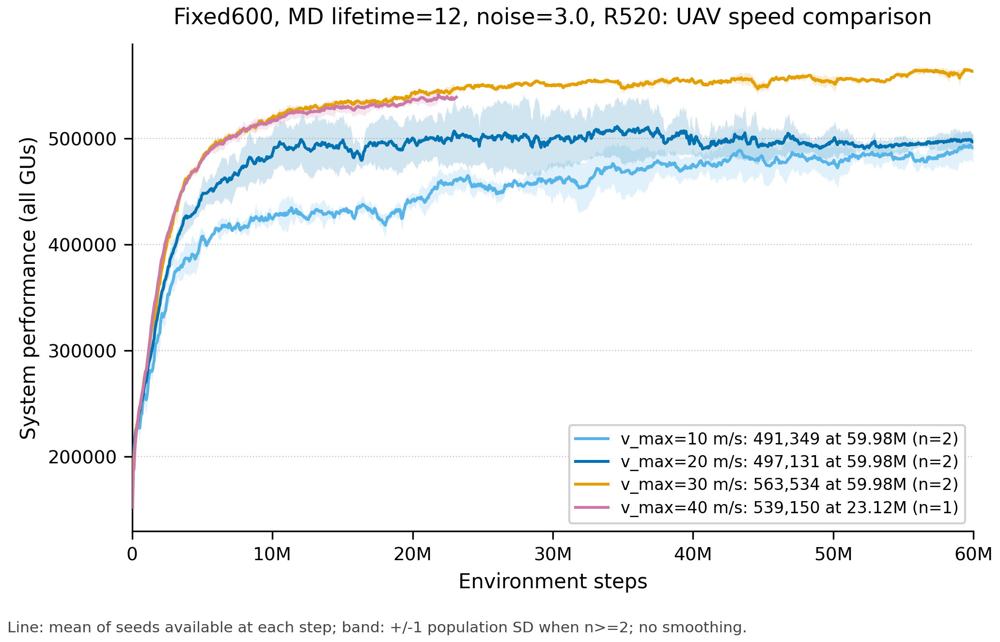

# UAV 最大速度对比实验记录

> 实验主题：固定 Fixed600-200 环境下，比较 UAV 最大飞行速度 `v_max=10/20/30/40 m/s` 的训练表现。
> 正式矩阵：4 个速度 × 3 个随机种子（2、32、42）= 12 个实验。
> 初始冻结快照：2026-08-12 20:07:46（Asia/Shanghai）。
> 当前归档刷新：2026-08-13 01:30:09；第 1.4、6.1 节是提交前最新状态，其余带时间戳表格均为历史快照。
> 对应 Codex 会话：`019fe540-5f03-76a2-9be7-e978764c8f54`，最后一轮 `019ff5db-c82f-7050-adae-b2bac63a9328`。
> 本文只记录速度对比；`seed22` 等先导实验保留为历史证据，但不纳入 12-run 正式统计。

## 1. 实验问题、假设与当前结论

### 1.1 实验问题

在环境、算法、Actor/Critic、PPO、训练预算全部固定的前提下，只改变 UAV 最大飞行速度，判断 `10/20/30/40 m/s` 哪个速度能获得更高的：

```text
agent0/system_performance_true_all_GUs
```

### 1.2 单变量合同

12 份实际 `args.json` 已逐字段审计。所有正式 run 之间只有以下三项不同：

```text
experiment_name
seed
v_max
```

环境、MD 生成与移动、Actor message、Critic、优势处理、归一化、PPO 超参数和 60M 训练预算均完全相同。因此这是一个有效的 `v_max` 单变量、多 seed 速度对比。

### 1.3 截止权威快照时能够下的结论

- `v_max=10/20/30` 的 seed32、seed42 已完成到 `59.9808M`；在这两个完整 seed 上，`v_max=30 m/s` 明显优于 10 和 20。
- 完整曲线末 100 个记录点、再对 seed32/42 求均值：v10 为 `485,026`，v20 为 `496,693`，v30 为 `562,608`。v30 相对 v20 高约 `13.27%`，相对 v10 高约 `15.99%`。
- 因而当前冻结值为 `v_max=30 m/s`；配合 `Delta_t=0.5 s`，单 slot 最大位移为 `15 m`。
- 快照时 v40 三个 seed 只到约 `7.76M–8.63M`，不能用早期曲线与 v30 的 60M 终值直接比较，也不能宣称“四个速度都已跑满且 v30 全局最优”。严谨结论是：**30 已在完整预算下胜过 10/20；40 等完整预算复核。**

### 1.4 2026-08-13 Git 归档时增量状态

归档前重新运行同一聚合脚本。三个远端 v40 冻结事件分别到 `23.1168M/22.5536M/21.7856M`，三 seed 共同预算为 `21.7856M`；本地仍在训练的 seed2 为 v10 `21.7856M`、v20 `21.7344M`、v30 `17.7408M`。这些只是进度刷新，不改变第 1.3 节基于完整 seed32/42 的选择：v30 继续冻结，v40 等完整 60M。

## 2. 12 个正式速度实验

### 2.1 结果目录规则

本地结果目录前缀：

```text
D:\wyj\Projects\on-policy-last-obs-clean-5UAV\onpolicy\scripts\results\mec\mappo\
```

远端 RTX 3090 结果目录前缀：

```text
/home/test/wyj/Projects/on-policy-last-obs-clean-5UAV/onpolicy/scripts/results/mec/mappo/
```

表中的名称即该前缀下的完整实验文件夹名，实际 TensorBoard、参数和模型目录位于 `<experiment_name>/run1/`。

### 2.2 正式 run 清单

| `v_max` | seed | 设备 | 正式结果文件夹名 | 2026-08-12 20:07 历史状态 |
|---:|---:|---|---|---:|
| 10 | 2 | 本地 | [`dcppoR520_fixed600_200_layoutctx_inputv2_peragentnoise_s3p0_md12_vmax10_seed2_60m_20260812`](onpolicy/scripts/results/mec/mappo/dcppoR520_fixed600_200_layoutctx_inputv2_peragentnoise_s3p0_md12_vmax10_seed2_60m_20260812/run1/) | 7.7568M / 60M |
| 10 | 32 | 远端 3090 | [`dcppoR520_fixed600_200_layoutctx_inputv2_peragentnoise_s3p0_md12_vmax10_seed32_60m_20260811_retry1`](onpolicy/scripts/results/mec/mappo/dcppoR520_fixed600_200_layoutctx_inputv2_peragentnoise_s3p0_md12_vmax10_seed32_60m_20260811_retry1/run1/) | 59.9808M，完成 |
| 10 | 42 | 本地 | [`dcppoR520_fixed600_200_layoutctx_inputv2_peragentnoise_s3p0_md12_vmax10_seed42_60m_20260811`](onpolicy/scripts/results/mec/mappo/dcppoR520_fixed600_200_layoutctx_inputv2_peragentnoise_s3p0_md12_vmax10_seed42_60m_20260811/run1/) | 59.9808M，完成 |
| 20 | 2 | 本地 | [`dcppoR520_fixed600_200_layoutctx_inputv2_peragentnoise_s3p0_md12_vmax20_seed2_60m_20260812`](onpolicy/scripts/results/mec/mappo/dcppoR520_fixed600_200_layoutctx_inputv2_peragentnoise_s3p0_md12_vmax20_seed2_60m_20260812/run1/) | 7.7568M / 60M |
| 20 | 32 | 远端 3090 | [`dcppoR520_fixed600_200_layoutctx_inputv2_peragentnoise_s3p0_md12_vmax20_seed32_60m_20260811_retry1`](onpolicy/scripts/results/mec/mappo/dcppoR520_fixed600_200_layoutctx_inputv2_peragentnoise_s3p0_md12_vmax20_seed32_60m_20260811_retry1/run1/) | 59.9808M，完成 |
| 20 | 42 | 本地 | [`dcppoR520_fixed600_200_layoutctx_inputv2_peragentnoise_s3p0_md12_vmax20_seed42_60m_20260811`](onpolicy/scripts/results/mec/mappo/dcppoR520_fixed600_200_layoutctx_inputv2_peragentnoise_s3p0_md12_vmax20_seed42_60m_20260811/run1/) | 59.9808M，完成 |
| 30 | 2 | 本地 | [`dcppoR520_fixed600_200_layoutctx_inputv2_peragentnoise_s3p0_md12_vmax30_seed2_60m_20260812`](onpolicy/scripts/results/mec/mappo/dcppoR520_fixed600_200_layoutctx_inputv2_peragentnoise_s3p0_md12_vmax30_seed2_60m_20260812/run1/) | 3.7120M / 60M |
| 30 | 32 | 远端 3090 | [`dcppoR520_fixed600_200_layoutctx_inputv2_peragentnoise_s3p0_md12_vmax30_seed32_60m_20260811_retry2`](onpolicy/scripts/results/mec/mappo/dcppoR520_fixed600_200_layoutctx_inputv2_peragentnoise_s3p0_md12_vmax30_seed32_60m_20260811_retry2/run1/) | 59.9808M，完成 |
| 30 | 42 | 本地 | [`dcppoR520_fixed600_200_layoutctx_inputv2_peragentnoise_s3p0_md12_vmax30_seed42_60m_20260811`](onpolicy/scripts/results/mec/mappo/dcppoR520_fixed600_200_layoutctx_inputv2_peragentnoise_s3p0_md12_vmax30_seed42_60m_20260811/run1/) | 59.9808M，完成 |
| 40 | 2 | 远端 3090 | [`dcppoR520_fixed600_200_layoutctx_inputv2_peragentnoise_s3p0_md12_vmax40_seed2_60m_20260812`](onpolicy/scripts/results/mec/mappo/dcppoR520_fixed600_200_layoutctx_inputv2_peragentnoise_s3p0_md12_vmax40_seed2_60m_20260812/run1/) | 8.5760M / 60M |
| 40 | 32 | 远端 3090 | [`dcppoR520_fixed600_200_layoutctx_inputv2_peragentnoise_s3p0_md12_vmax40_seed32_60m_20260812`](onpolicy/scripts/results/mec/mappo/dcppoR520_fixed600_200_layoutctx_inputv2_peragentnoise_s3p0_md12_vmax40_seed32_60m_20260812/run1/) | 8.6272M / 60M |
| 40 | 42 | 远端 3090 | [`dcppoR520_fixed600_200_layoutctx_inputv2_peragentnoise_s3p0_md12_vmax40_seed42_60m_20260812`](onpolicy/scripts/results/mec/mappo/dcppoR520_fixed600_200_layoutctx_inputv2_peragentnoise_s3p0_md12_vmax40_seed42_60m_20260812/run1/) | 7.7568M / 60M |

补充说明：远端 v10 seed32 的正式数据使用 `retry1/run1`，重复生成的 `run2` 未使用；远端 v30 seed32 使用 `retry2/run1`，较早的失败/空事件 retry 未使用。

### 2.3 远端 run 的本地冻结参数

远端原始结果已经按原目录名完整同步到本地正式结果根目录：

```text
D:\wyj\Projects\on-policy-last-obs-clean-5UAV\onpolicy\scripts\results\mec\mappo\<experiment_name>\run1\
```

本地与远端实验现在使用同一层级结构；6 个远端 run 均已归档 `args.json`、TensorBoard 事件、`logs/`、`models/` 等完整实验目录，独立控制台日志归档在 `training_logs/`。为保留 2026-08-12 20:07 对比图的冻结证据，早先抽取的事件文件和参数副本仍保留在 [`analysis/fixed600_speed_3seed_20260812/data/remote/`](analysis/fixed600_speed_3seed_20260812/data/remote/)：

这里的“完整归档”仅指本地设备保存，不等于全部纳入 Git。本次 Git 归档只收录参数 JSON、轻量汇总 JSON/CSV、绘图脚本、最终图和总结文档；模型、原始 TensorBoard events、完整 `logs/`、`training_logs/` 仍仅保留在本地，未删除。

| 远端 run | 本地参数快照 |
|---|---|
| v10 / seed32 / `...retry1` | [`vmax10_seed32.args.json`](analysis/fixed600_speed_3seed_20260812/data/remote/vmax10_seed32.args.json) |
| v20 / seed32 / `...retry1` | [`vmax20_seed32.args.json`](analysis/fixed600_speed_3seed_20260812/data/remote/vmax20_seed32.args.json) |
| v30 / seed32 / `...retry2` | [`vmax30_seed32.args.json`](analysis/fixed600_speed_3seed_20260812/data/remote/vmax30_seed32.args.json) |
| v40 / seed2 | [`vmax40_seed2.args.json`](analysis/fixed600_speed_3seed_20260812/data/remote/vmax40_seed2.args.json) |
| v40 / seed32 | [`vmax40_seed32.args.json`](analysis/fixed600_speed_3seed_20260812/data/remote/vmax40_seed32.args.json) |
| v40 / seed42 | [`vmax40_seed42.args.json`](analysis/fixed600_speed_3seed_20260812/data/remote/vmax40_seed42.args.json) |

历史归档状态（首次完整同步于 2026-08-12 22:10–22:16）：

| run | 本地完整归档 | 首次归档时事件进度 | 状态 |
|---|---|---:|---|
| v10 / seed32 / `...retry1` | [`run1/`](onpolicy/scripts/results/mec/mappo/dcppoR520_fixed600_200_layoutctx_inputv2_peragentnoise_s3p0_md12_vmax10_seed32_60m_20260811_retry1/run1/) | 59.9808M | 最终归档 |
| v20 / seed32 / `...retry1` | [`run1/`](onpolicy/scripts/results/mec/mappo/dcppoR520_fixed600_200_layoutctx_inputv2_peragentnoise_s3p0_md12_vmax20_seed32_60m_20260811_retry1/run1/) | 59.9808M | 最终归档 |
| v30 / seed32 / `...retry2` | [`run1/`](onpolicy/scripts/results/mec/mappo/dcppoR520_fixed600_200_layoutctx_inputv2_peragentnoise_s3p0_md12_vmax30_seed32_60m_20260811_retry2/run1/) | 59.9808M | 最终归档 |
| v40 / seed2 | [`run1/`](onpolicy/scripts/results/mec/mappo/dcppoR520_fixed600_200_layoutctx_inputv2_peragentnoise_s3p0_md12_vmax40_seed2_60m_20260812/run1/) | 15.2320M | 增量快照，需在训练结束后再同步 |
| v40 / seed32 | [`run1/`](onpolicy/scripts/results/mec/mappo/dcppoR520_fixed600_200_layoutctx_inputv2_peragentnoise_s3p0_md12_vmax40_seed32_60m_20260812/run1/) | 14.9760M | 增量快照，需在训练结束后再同步 |
| v40 / seed42 | [`run1/`](onpolicy/scripts/results/mec/mappo/dcppoR520_fixed600_200_layoutctx_inputv2_peragentnoise_s3p0_md12_vmax40_seed42_60m_20260812/run1/) | 14.2080M | 增量快照，需在训练结束后再同步 |

同步采用 [`onpolicy/scripts/sync_remote3090_speed_results.py`](onpolicy/scripts/sync_remote3090_speed_results.py)。它按文件大小和修改时间增量下载，使用 `.part` 临时文件后原子替换，并在每个实验结束时比较远端/本地相对路径和文件大小清单；脚本不会删除远端文件，也不会把密码写入仓库：

```powershell
cd D:\wyj\Projects\on-policy-last-obs-clean-5UAV
python .\onpolicy\scripts\sync_remote3090_speed_results.py
```

运行后按提示输入远端密码即可。v40 仍在训练时可以重复运行；三条 v40 进程结束后必须再运行一次，才能把增量快照升级为最终归档。

对应的远端控制台日志也已保存：

- [`v10 seed32 retry1`](training_logs/dcppoR520_fixed600_200_layoutctx_inputv2_peragentnoise_s3p0_md12_vmax10_seed32_60m_20260811_retry1.log)
- [`v20 seed32 retry1`](training_logs/dcppoR520_fixed600_200_layoutctx_inputv2_peragentnoise_s3p0_md12_vmax20_seed32_60m_20260811_retry1.log)
- [`v30 seed32 retry2`](training_logs/dcppoR520_fixed600_200_layoutctx_inputv2_peragentnoise_s3p0_md12_vmax30_seed32_60m_20260811_retry2.log)
- [`v40 seed2`](training_logs/dcppoR520_fixed600_200_layoutctx_inputv2_peragentnoise_s3p0_md12_vmax40_seed2_60m_20260812.log)
- [`v40 seed32`](training_logs/dcppoR520_fixed600_200_layoutctx_inputv2_peragentnoise_s3p0_md12_vmax40_seed32_60m_20260812.log)
- [`v40 seed42`](training_logs/dcppoR520_fixed600_200_layoutctx_inputv2_peragentnoise_s3p0_md12_vmax40_seed42_60m_20260812.log)

## 3. 启动脚本与执行入口

### 3.1 本地 seed2

- v10：[启动脚本](onpolicy/scripts/train/run_fixed600_200_dcppo_R520_noise3p0_md12_vmax10_seed2_20260812.ps1)
- v20：[启动脚本](onpolicy/scripts/train/run_fixed600_200_dcppo_R520_noise3p0_md12_vmax20_seed2_20260812.ps1)
- v30：[启动脚本](onpolicy/scripts/train/run_fixed600_200_dcppo_R520_noise3p0_md12_vmax30_seed2_20260812.ps1)

### 3.2 本地 seed42

- v10：[启动脚本](onpolicy/scripts/train/run_fixed600_200_dcppo_R520_noise3p0_md12_vmax10_seed42.ps1)
- v20：[启动脚本](onpolicy/scripts/train/run_fixed600_200_dcppo_R520_noise3p0_md12_vmax20_seed42.ps1)
- v30：[启动脚本](onpolicy/scripts/train/run_fixed600_200_dcppo_R520_noise3p0_md12_vmax30_seed42.ps1)

上述 6 个 PowerShell 包装器都进入同一个公共参数入口：

- [`onpolicy/scripts/train/run_fixed2hotspot_per_agent_noise.ps1`](onpolicy/scripts/train/run_fixed2hotspot_per_agent_noise.ps1)
- 本地解释器：`C:\Users\wyj2\.conda\envs\marl\python.exe`
- 训练入口：[`onpolicy/scripts/train/train_mec.py`](onpolicy/scripts/train/train_mec.py)

### 3.3 远端 seed32 与 v40 三 seed

远端统一使用参数化 Bash 启动器：

- [`onpolicy/scripts/train/run_fixed600_200_dcppo_R520_noise3p0_md12_seed32_vmax.sh`](onpolicy/scripts/train/run_fixed600_200_dcppo_R520_noise3p0_md12_seed32_vmax.sh)
- 远端解释器：`/home/test/miniconda3/envs/marl/bin/python`

脚本文件名虽保留 `seed32`，但第三个位置参数已支持任意非负 seed。形式为：

```bash
bash onpolicy/scripts/train/run_fixed600_200_dcppo_R520_noise3p0_md12_seed32_vmax.sh \
  <10|20|30|40> <experiment_name> <seed>
```

v40 的三个正式启动参数分别为：

```bash
bash onpolicy/scripts/train/run_fixed600_200_dcppo_R520_noise3p0_md12_seed32_vmax.sh 40 dcppoR520_fixed600_200_layoutctx_inputv2_peragentnoise_s3p0_md12_vmax40_seed2_60m_20260812 2
bash onpolicy/scripts/train/run_fixed600_200_dcppo_R520_noise3p0_md12_seed32_vmax.sh 40 dcppoR520_fixed600_200_layoutctx_inputv2_peragentnoise_s3p0_md12_vmax40_seed32_60m_20260812 32
bash onpolicy/scripts/train/run_fixed600_200_dcppo_R520_noise3p0_md12_seed32_vmax.sh 40 dcppoR520_fixed600_200_layoutctx_inputv2_peragentnoise_s3p0_md12_vmax40_seed42_60m_20260812 42
```

## 4. 12 个正式实验共用的完整参数合同

### 4.1 运行与训练预算

| 参数 | 值 | 说明 |
|---|---:|---|
| `env_name` | `mec` | MEC 环境 |
| `algorithm_name` | `mappo` | PPO 实现入口；实际为 separated runner |
| `num_env_steps` | 60,000,000 | 每个 run 的完整预算 |
| `episode_length` | 400 | 每 episode 400 slots |
| `Delta_t` | 0.5 s | 每 episode 对应 200 s 物理时间 |
| `n_rollout_threads` | 64 | 每次 rollout 并行环境数 |
| `n_training_threads` | 1 | Torch 训练线程 |
| `seed` | 2 / 32 / 42 | 三个正式随机种子 |
| `v_max` | 10 / 20 / 30 / 40 m/s | 唯一实验自变量 |
| `cuda` / `cuda_deterministic` | true / true | 使用 CUDA 且确定性配置开启 |
| `use_eval` | false | 本轮使用训练日志指标比较 |

一次 PPO update 采样 `400×64=25,600` 个环境步；60M 预算的最后一个完整记录点为 `59,980,800`。

### 4.2 地图、热点和 UAV

| 参数 | 值 |
|---|---|
| `n_UAVs` | 5 |
| `x/y_min/max_uav` | `[0,600] × [0,600] m` |
| `x/y_min/max_gu` | `[0,600] × [0,600] m` |
| `hotspot_layout_mode` | `episode_template4_600_200` |
| 实际模板 | 固定 index 0；小区 `[0,200]×[0,200]`，大区 `[200,600]×[200,600]` |
| `fix_hotspot` | true |
| `episode_layout_context` | true |
| `episode_layout_context_units` | `meters_v2` |
| `five_uav_start_layout` | `line` |
| `uav_start_positions` | `(110,180),(220,180),(330,180),(440,180),(400,400)` |
| `H_UAV` / `H_GU` | 120 m / 1 m |
| `Cover_R` | 120 m |
| `d_optimal` | 210 m |
| `uav_reset_curriculum` | false |

这里的 Fixed600-200 是固定速度选择环境，不是 Random12-600 泛化环境，也不是旧的 175 m `fixed_legacy` 环境。

### 4.3 动态 MD、任务和通信计算资源

| 参数 | 值 |
|---|---|
| `dynamic_md` | true |
| `n_GUs` | 60 个槽位 |
| `max_GUs_in_range` | 20 |
| `md_arrivals_min/max` | 5 / 5 |
| `md_arrivals_per_region` | `[1,4]`，小区 1、大区 4 |
| `md_lifetime_min/max` | 12 / 12 slots |
| `mean_velocity` | 3 m/s |
| `md_velocity_init_std` | 0.6 |
| `md_velocity_init_min/max_factor` | 0.4 / 1.6 |
| `md_velocity_update_clip_min/max` | 0 / 5 m/s |
| `D_min/max` | 200,000 / 400,000 bits |
| `C_min/max` | 675,000,000 / 800,000,000 cycles |
| `delay_min/max` | 0.499 / 0.5 s |
| `B` | 30,000,000 Hz |
| `F_m` | 20,000,000,000 cycles/s |
| `F_n` | 1,500,000,000 cycles/s |
| `Dis_min` | 3 m |

`n_GUs=60` 是活动 MD 槽位容量，并不表示任何时刻都固定有 60 个活动 MD。

### 4.4 算法、通信和优势处理

| 参数 | 值 | 实际含义 |
|---|---|---|
| `share_policy` | false | 启动器传 `--share_policy`，该参数是 `store_false`；最终是五套独立策略 |
| `share_actor` | false | Actor 不共享 |
| `use_centralized_V` | true | 使用 critic state 输入 |
| `local_reward` | true | 每个 UAV 使用局部奖励 |
| `neighbor_distance` | 520 m | Actor message、critic mask、优势共识图的主要半径 |
| `neighbor_R` | 520 | legacy/兼容半径字段 |
| `max_UAVs_in_neighbor` | 5 | 最多 5 个 UAV token |
| `actor_neighbor_obs` | false | 不使用旧式邻居位置拼接 |
| `actor_message_mode` | `task_summary` | 正式 12-run 均启用 Actor message |
| `actor_message_pool` | `receiver_gated_sum` | 接收端门控求和 |
| `actor_message_contract` | `absolute_raw_v2` | 绝对米制/原始量消息合同 |
| `spatial_flight_actor` | true | 独立空间飞行头 |
| `completion_priority_user_sort` | true | 用户按完成优先规则排序 |
| `continuous_associate` | true | 连续关联动作 |
| `cartesian_flight` | true | 笛卡尔飞行动作 |
| `state_is_k_hops` | true | critic state 使用 k-hop 邻域 |
| `all_uav_k_hops` | true | k-hop 中纳入所有满足 mask 的 UAV |
| `use_atten_critic` | true | attention critic |
| `ego_query_critic` | true | ego token 作为 query |
| `advantage_mode` | `per_agent_noise` | 每 UAV 优势分支 |
| `noise_scale` | 3.0 | 自适应噪声缩放参数 |
| `n_iterations` | 50 | Metropolis 优势共识迭代次数 |
| `whether_average_network_parameters` | false | 不做网络参数平均 |

因此，目录名中的 `dcppoR520` 不应只理解为普通共享策略 MAPPO。更准确的执行合同是：五套独立策略的 separated MAPPO/PPO 后端，局部奖励、R520 联合通信、Spatial Cartesian Flight Actor、receiver-gated task-summary Actor message、R520 ego-query attention critic，以及 `per_agent_noise/noise_scale=3/K=50` 优势处理。

### 4.5 Actor 与 Critic 输入合同

正式 12-run 使用 Actor message：

```text
Actor 原始 observation = 251 维
  = 自身 xy 2
  + 布局上下文 8
  + 本地活动数 1
  + 20 个本地用户 × 10 维 = 200
  + Actor-only task-summary message = 40
```

- 资源/关联/带宽/计算头主动删除 40 维 Actor-only message，只读取 211 维本地任务信息。
- Spatial flight head 使用空间、移动、布局与邻机消息相关子集；显式 task-summary message 的结构作用主要落在飞行头。
- Critic 从 observation 中删除 40 维 Actor-only message，得到每 UAV `211` 维 token；R520 内最多 5 个 token，拼接原始 state 最大为 `5×211=1055` 维，再由 attention critic 处理，token 0 为 ego query。
- 12 个速度 run 均为 `actor_message_mode=task_summary`；`no_actor_message` 不是本速度矩阵的变量。

### 4.6 PPO、网络与归一化

| 参数 | 值 |
|---|---:|
| `hidden_size` | 256 |
| `layer_N` | 2 |
| `use_ReLU` | true |
| `use_orthogonal` | true |
| `gain` | 0.01 |
| Actor `lr` | 0.0001 |
| `critic_lr` | 0.0005 |
| `clip_param` | 0.15 |
| `ppo_epoch` | 4 |
| `num_mini_batch` | 1 |
| `entropy_coef` | 0 |
| `value_loss_coef` | 0.5 |
| `gamma` | 0.99 |
| `gae_lambda` | 0.95 |
| `use_gae` | true |
| `use_clipped_value_loss` | true |
| `use_huber_loss` / `huber_delta` | true / 10 |
| `use_max_grad_norm` / `max_grad_norm` | true / 0.5 |
| `use_feature_normalization` | true |
| `ob_norm` | true |
| `ret_norm` | true |
| `shared_ret_norm` | true |
| `use_valuenorm` | false |
| recurrent policy | false |

### 4.7 奖励参数

```text
alpha_r=32, beta_r=0.5, q1=1
gamma_r=26, delta_r=32, q2=1
epsilon_r=0, q3=1
lambda_r=1e-6, q4=1
mu_r=64, q5=1
w1=20, w2=1, p3=500
local_reward=true
not_served_rew_to_nearest=true
```

这里的环境奖励权重 `gamma_r=26` 与 PPO 折扣因子 `gamma=0.99` 是两个不同参数。

完整、机器可读的逐字段值以每个 `run1/args.json` 和 [`progress_summary.json`](analysis/fixed600_speed_3seed_20260812/progress_summary.json) 为最高优先级；本节是便于阅读的合同摘要。

## 5. 汇总脚本、图片和可复现产物

指定会话最后一轮生成的权威目录为：

```text
analysis/fixed600_speed_3seed_20260812/
```

目录内产物：

- 绘图与聚合脚本：[`plot.py`](analysis/fixed600_speed_3seed_20260812/plot.py)
- 300-DPI 对比图：[`plot.png`](analysis/fixed600_speed_3seed_20260812/plot.png)
- 机器可读进度、来源和聚合结果：[`progress_summary.json`](analysis/fixed600_speed_3seed_20260812/progress_summary.json)
- 12-run 选择及逐字段参数审计：[`audit.md`](analysis/fixed600_speed_3seed_20260812/audit.md)
- 绘图合同：[`figure-spec.md`](analysis/fixed600_speed_3seed_20260812/figure-spec.md)
- 图像 QA 状态：[`final-status.md`](analysis/fixed600_speed_3seed_20260812/final-status.md)
- 远端冻结事件与参数：[`data/remote/`](analysis/fixed600_speed_3seed_20260812/data/remote/)

在仓库根目录可使用本项目 `marl` 环境重新生成图：

```powershell
& 'C:\Users\wyj2\.conda\envs\marl\python.exe' '.\analysis\fixed600_speed_3seed_20260812\plot.py'
```

### 5.1 速度对比图



### 5.2 曲线聚合合同

- 指标：`agent0/system_performance_true_all_GUs`。
- 以 12 条 TensorBoard 曲线的环境步并集作为横轴网格。
- 每个 seed 只在自己的实际观测范围内线性插值；不外推、不平滑。
- 每个 step 的实线为已经到达该 step 的所有 seed 的均值。
- 至少两个 seed 可用时，阴影为 `±1` 个 population standard deviation。
- 只有一个 seed 的尾段保留实线，但不画不确定性带。
- 不把不同训练预算的末端点直接当作公平终值比较。

## 6. 快照结果

### 6.1 图中最后一个可用聚合点

| `v_max` | 最后聚合 step | 可用 seed 数 | 图中终点均值 | population std |
|---:|---:|---:|---:|---:|
| 10 | 59.9808M | 2 | 491,349 | 13,005 |
| 20 | 59.9808M | 2 | 497,131 | 6,932 |
| 30 | 59.9808M | 2 | 563,534 | 1,080 |
| 40 | 23.1168M | 1 | 539,150 | 不适用 |

注意：这是 2026-08-13 01:30 刷新后各曲线“最后一个可用记录点”的图例值，不是更稳健的 tail-window 统计。v40 在 `21.7856M` 之后可用 seed 数开始下降，到 `23.1168M` 只有 seed2，因此不能与前三行 59.9808M 的终点排名。

### 6.2 完整 60M 曲线的 tail100 结果

| `v_max` | seed32，远端 tail100 | seed42，本地 tail100 | 两 seed 均值 | population std |
|---:|---:|---:|---:|---:|
| 10 | 474,290 | 495,761 | **485,026** | 10,736 |
| 20 | 489,926 | 503,460 | **496,693** | 6,767 |
| 30 | 562,101 | 563,115 | **562,608** | 507 |

这组完整预算统计是当前选择 v30 的主要证据。v40 未到 60M，因此不进入该表。

### 6.3 四速度共同早期预算点

四个速度的三个 seed 都达到的共同预算约为 `3.8144M`。该点的三 seed 均值 ± population std 为：

| `v_max` | 3.8144M 表现 |
|---:|---:|
| 10 | 387,605 ± 14,418 |
| 20 | 427,049 ± 15,263 |
| 30 | 462,171 ± 2,734 |
| 40 | 458,074 ± 895 |

早期共同预算下 v30 与 v40 接近，但这只能描述早期优化，不能代替完整 60M 的最终选择。

## 7. `seed22` 和其他历史/排除目录

用户提到的文件夹确实存在：

- [`dcppoR520_fixed600_200_layoutctx_inputv2_peragentnoise_s3p0_md12_vmax40_seed22_60m_20260811`](onpolicy/scripts/results/mec/mappo/dcppoR520_fixed600_200_layoutctx_inputv2_peragentnoise_s3p0_md12_vmax40_seed22_60m_20260811/run1/)
- [`dcppoR520_fixed600_200_layoutctx_inputv2_peragentnoise_s3p0_md12_vmax20_seed22_60m_20260811`](onpolicy/scripts/results/mec/mappo/dcppoR520_fixed600_200_layoutctx_inputv2_peragentnoise_s3p0_md12_vmax20_seed22_60m_20260811/run1/)

它们属于 2026-08-11 的先导速度尝试，不属于本次预先统一为 seed 2/32/42 的正式 12-run 矩阵，因此不进入 `plot.png` 的三 seed 均值与误差带。

同样被排除的本地旧 seed2 目录包括：

- `...vmax10_seed2_60m_20260811`
- `...vmax20_seed2_60m_20260810`
- `...vmax30_seed2_60m_20260810`
- `...vmax40_seed2_60m_20260810`

排除原则不是这些实验“无效”，而是正式速度图只接受表 2.2 中约定的 12 个唯一来源，避免把重跑、早停、旧日期或不同 seed 计划重复计入统计。

## 8. 设备与代码可复现性边界

- 本地速度 run 的仓库为 `D:\wyj\Projects\on-policy-last-obs-clean-5UAV`；记录时分支为 `agent/dcppo-runtime-optimization`，HEAD 为 `716e080ac9cfaeed95a336ae0e14c8e696ed4c89`。
- 实验执行时工作树存在未提交修改，因此应以**实际工作树代码、启动脚本、每个 run 的 `args.json` 和实际事件文件**共同作为证据，不能只按 HEAD 推断。
- 远端项目当时没有可用的 Git 元数据。本地已冻结远端实际 `args.json` 和 TensorBoard 事件，但没有一份能够证明远端源代码与本地逐字节相同的独立 commit/SHA manifest。
- 已确认的是：12 路参数合同一致，且远端日志可复现本图；尚缺的是远端训练源代码的独立哈希证明。

## 9. 后续更新门槛

1. v40 的 seed2/32/42 全部达到完整 60M 后，刷新远端事件与 `args.json`，再用同一脚本重画。
2. 本地 v10/v20/v30 seed2 完成后，将完整预算 tail100 升级为三 seed 统计。
3. 只有完成上述更新后，才能把“30 胜过完整的 10/20”升级为“10/20/30/40 四速度的最终三 seed 选择”。
4. 后续任何 run 若修改了除 `v_max`、`seed`、`experiment_name` 以外的参数，必须作为新协议单独建图，不能补进本 12-run 矩阵。

## 10. 最终记录状态

```text
正式实验数：12
速度：10/20/30/40 m/s
seeds：2/32/42
参数一致性审计：通过
图片 QA：通过
当前冻结速度：30 m/s
结论边界：30 已完整胜过 10/20；40 待完整 60M
```
